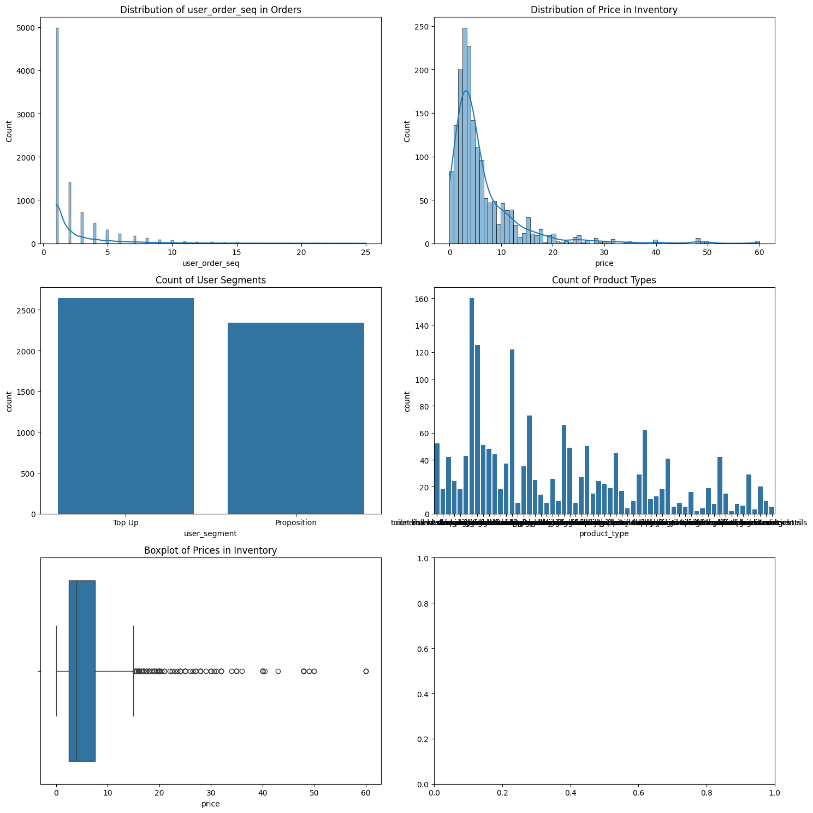

```python
import pandas as pd
import matplotlib.pyplot as plt
import seaborn as sns

# Define the path where the Parquet files are located
data_path = '/home/eduardo_1999/projects/zrive-ds/projects/zrive-ds/sampled-datasets/'

# Load the Parquet files using the full path
try:
    orders = pd.read_parquet(data_path + 'orders.parquet')
    regulars = pd.read_parquet(data_path + 'regulars.parquet')
    abandoned_cart = pd.read_parquet(data_path + 'abandoned_carts.parquet')  # Ensure to use the correct name
    inventory = pd.read_parquet(data_path + 'inventory.parquet')
    users = pd.read_parquet(data_path + 'users.parquet')
except Exception as e:
    print(f"Error loading data: {e}")

# Convert date columns in the DataFrames
orders['created_at'] = pd.to_datetime(orders['created_at'])
orders['order_date'] = pd.to_datetime(orders['order_date'])
regulars['created_at'] = pd.to_datetime(regulars['created_at'])
abandoned_cart['created_at'] = pd.to_datetime(abandoned_cart['created_at'])

# 3. Initial Data Exploration
dataframes = {
    "Orders": orders,
    "Regulars": regulars,
    "Abandoned Cart": abandoned_cart,
    "Inventory": inventory,
    "Users": users
}

for name, df in dataframes.items():
    print(f"\nInitial exploration for {name}:")
    print(df.head())
    print(df.info())
    print(df.describe(include='all'))  # Include all types of data in description
    print("Null values:", df.isnull().sum())
    
    # Check for complex data types
    complex_columns = []
    for col in df.select_dtypes(include=['object']).columns:
        if df[col].apply(type).eq(list).any():  # Check if any entry in the column is a list
            complex_columns.append(col)

    if complex_columns:
        print(f"Complex columns in {name} that may cause issues: {complex_columns}")

# 4. Data Cleaning
for name, df in dataframes.items():
    # Identify and remove duplicates
    try:
        duplicates = df.duplicated().sum()
        print(f"\nDuplicates in {name}: {duplicates}")
        if duplicates > 0:
            df.drop_duplicates(inplace=True)
    except Exception as e:
        print(f"Error checking duplicates in {name}: {e}")

    # Handle null values
    null_counts = df.isnull().sum()
    print(f"Null values in {name}: {null_counts[null_counts > 0]}")

    # Convert complex columns to string
    for col in complex_columns:
        df[col] = df[col].astype(str)

# 5. Univariate Analysis
fig, axes = plt.subplots(3, 2, figsize=(15, 15))
axes = axes.flatten()

# Histograms for numeric variables
sns.histplot(orders['user_order_seq'], kde=True, ax=axes[0])
axes[0].set_title('Distribution of user_order_seq in Orders')

sns.histplot(inventory['price'], kde=True, ax=axes[1])
axes[1].set_title('Distribution of Price in Inventory')

# Bar charts for categorical variables
sns.countplot(x='user_segment', data=users, ax=axes[2])
axes[2].set_title('Count of User Segments')

sns.countplot(x='product_type', data=inventory, ax=axes[3])
axes[3].set_title('Count of Product Types')

# Boxplot to see the spread of prices
sns.boxplot(x='price', data=inventory, ax=axes[4])
axes[4].set_title('Boxplot of Prices in Inventory')

plt.tight_layout()
plt.show()

# 6. Bivariate Analysis
fig, axes = plt.subplots(2, 2, figsize=(15, 10))
axes = axes.flatten()

# Scatter plot between price and compare_at_price
sns.scatterplot(x='price', y='compare_at_price', data=inventory, ax=axes[0])
axes[0].set_title('Relationship between Price and Compare At Price')

# Correlation matrix
correlation_matrix = orders.corr()
sns.heatmap(correlation_matrix, annot=True, fmt=".2f", ax=axes[1])
axes[1].set_title('Correlation Matrix of Orders')

# Boxplot of prices by user segment
sns.boxplot(x='user_segment', y='price', data=inventory, ax=axes[2])
axes[2].set_title('Boxplot of Prices by User Segment')

plt.tight_layout()
plt.show()

# 7. Multivariate Analysis
# Pairplot to observe relationships in more variables
sns.pairplot(inventory[['price', 'compare_at_price', 'variant_id']], diag_kind='kde')
plt.title('Pair Plots in Inventory')
plt.show()

# 8. Outlier Detection
# Boxplot to detect outliers
plt.figure(figsize=(10, 5))
sns.boxplot(x=inventory['price'])
plt.title('Outlier Detection in Prices')
plt.show()

# 9. Data Visualization
# Visualizations already conducted earlier.

# 10. Hypothesis Formulation
# Formulations to be made based on the analysis:
# - Product prices tend to be correlated with their compare prices.
# - User segmentation may influence purchasing decisions.

# Save cleaned DataFrames if necessary
orders.to_csv(data_path + 'cleaned_orders.csv', index=False)
regulars.to_csv(data_path + 'cleaned_regulars.csv', index=False)
abandoned_cart.to_csv(data_path + 'cleaned_abandoned_cart.csv', index=False)
inventory.to_csv(data_path + 'cleaned_inventory.csv', index=False)
users.to_csv(data_path + 'cleaned_users.csv', index=False)


```

    
    Initial exploration for Orders:
                   id                                            user_id  \
    10  2204073066628  62e271062eb827e411bd73941178d29b022f5f2de9d37f...   
    20  2204707520644  bf591c887c46d5d3513142b6a855dd7ffb9cc00697f6f5...   
    21  2204838822020  329f08c66abb51f8c0b8a9526670da2d94c0c6eef06700...   
    34  2208967852164  f6451fce7b1c58d0effbe37fcb4e67b718193562766470...   
    49  2215889436804  68e872ff888303bff58ec56a3a986f77ddebdbe5c279e7...   
    
                created_at order_date  user_order_seq  \
    10 2020-04-30 14:32:19 2020-04-30               1   
    20 2020-04-30 17:39:00 2020-04-30               1   
    21 2020-04-30 18:12:30 2020-04-30               1   
    34 2020-05-01 19:44:11 2020-05-01               1   
    49 2020-05-03 21:56:14 2020-05-03               1   
    
                                            ordered_items  
    10  [33618849693828, 33618860179588, 3361887404045...  
    20  [33618835243140, 33618835964036, 3361886244058...  
    21  [33618891145348, 33618893570180, 3361889766618...  
    34  [33618830196868, 33618846580868, 3361891234624...  
    49  [33667166699652, 33667166699652, 3366717122163...  
    <class 'pandas.core.frame.DataFrame'>
    Index: 8773 entries, 10 to 64538
    Data columns (total 6 columns):
     #   Column          Non-Null Count  Dtype         
    ---  ------          --------------  -----         
     0   id              8773 non-null   int64         
     1   user_id         8773 non-null   object        
     2   created_at      8773 non-null   datetime64[us]
     3   order_date      8773 non-null   datetime64[us]
     4   user_order_seq  8773 non-null   int64         
     5   ordered_items   8773 non-null   object        
    dtypes: datetime64[us](2), int64(2), object(2)
    memory usage: 479.8+ KB
    None
                      id                                            user_id  \
    count   8.773000e+03                                               8773   
    unique           NaN                                               4983   
    top              NaN  ba7176c5f870cd86e51ecc4375e0becc8cc305845e70b9...   
    freq             NaN                                                 25   
    mean    3.684684e+12                                                NaN   
    min     2.204073e+12                                                NaN   
    25%     3.690255e+12                                                NaN   
    50%     3.846692e+12                                                NaN   
    75%     3.945086e+12                                                NaN   
    max     4.026732e+12                                                NaN   
    std     4.145437e+11                                                NaN   
    
                            created_at                  order_date  \
    count                         8773                        8773   
    unique                         NaN                         NaN   
    top                            NaN                         NaN   
    freq                           NaN                         NaN   
    mean    2021-08-22 03:54:18.750028  2021-08-21 12:47:21.262966   
    min            2020-04-30 14:32:19         2020-04-30 00:00:00   
    25%            2021-04-25 11:50:37         2021-04-25 00:00:00   
    50%            2021-10-11 11:29:44         2021-10-11 00:00:00   
    75%            2022-01-03 18:14:23         2022-01-03 00:00:00   
    max            2022-03-14 00:24:59         2022-03-14 00:00:00   
    std                            NaN                         NaN   
    
            user_order_seq                                      ordered_items  
    count      8773.000000                                               8773  
    unique             NaN                                               8773  
    top                NaN  [33618849693828, 33618860179588, 3361887404045...  
    freq               NaN                                                  1  
    mean          2.445116                                                NaN  
    min           1.000000                                                NaN  
    25%           1.000000                                                NaN  
    50%           1.000000                                                NaN  
    75%           3.000000                                                NaN  
    max          25.000000                                                NaN  
    std           2.707693                                                NaN  
    Null values: id                0
    user_id           0
    created_at        0
    order_date        0
    user_order_seq    0
    ordered_items     0
    dtype: int64
    
    Initial exploration for Regulars:
                                                  user_id      variant_id  \
    3   68e872ff888303bff58ec56a3a986f77ddebdbe5c279e7...  33618848088196   
    11  aed88fc0b004270a62ff1fe4b94141f6b1db1496dbb0c0...  33667178659972   
    18  68e872ff888303bff58ec56a3a986f77ddebdbe5c279e7...  33619009208452   
    46  aed88fc0b004270a62ff1fe4b94141f6b1db1496dbb0c0...  33667305373828   
    47  4594e99557113d5a1c5b59bf31b8704aafe5c7bd180b32...  33667247341700   
    
                created_at  
    3  2020-04-30 15:07:03  
    11 2020-05-05 23:34:35  
    18 2020-04-30 15:07:03  
    46 2020-05-05 23:34:35  
    47 2020-05-06 14:42:11  
    <class 'pandas.core.frame.DataFrame'>
    Index: 18105 entries, 3 to 37720
    Data columns (total 3 columns):
     #   Column      Non-Null Count  Dtype         
    ---  ------      --------------  -----         
     0   user_id     18105 non-null  object        
     1   variant_id  18105 non-null  int64         
     2   created_at  18105 non-null  datetime64[us]
    dtypes: datetime64[us](1), int64(1), object(1)
    memory usage: 565.8+ KB
    None
                                                      user_id    variant_id  \
    count                                               18105  1.810500e+04   
    unique                                               1448           NaN   
    top     a124c8bb0453ea0957405b7a08a7fd377247bac054a097...           NaN   
    freq                                                  726           NaN   
    mean                                                  NaN  3.511989e+13   
    min                                                   NaN  3.361527e+13   
    25%                                                   NaN  3.382643e+13   
    50%                                                   NaN  3.422171e+13   
    75%                                                   NaN  3.448855e+13   
    max                                                   NaN  4.013362e+13   
    std                                                   NaN  2.171237e+12   
    
                            created_at  
    count                        18105  
    unique                         NaN  
    top                            NaN  
    freq                           NaN  
    mean    2021-08-15 02:27:30.703728  
    min            2020-04-30 13:09:27  
    25%            2021-03-21 10:41:42  
    50%            2021-10-16 09:11:26  
    75%            2022-01-14 22:35:14  
    max            2022-03-14 07:49:24  
    std                            NaN  
    Null values: user_id       0
    variant_id    0
    created_at    0
    dtype: int64
    
    Initial exploration for Abandoned Cart:
                    id                                            user_id  \
    0   12858560217220  5c4e5953f13ddc3bc9659a3453356155e5efe4739d7a2b...   
    13  20352449839236  9d6187545c005d39e44d0456d87790db18611d7c7379bd...   
    45  20478401413252  e83fb0273d70c37a2968fee107113698fd4f389c442c0b...   
    50  20481783103620  10c42e10e530284b7c7c50f3a23a98726d5747b8128084...   
    52  20485321687172  d9989439524b3f6fc4f41686d043f315fb408b954d6153...   
    
                created_at                                         variant_id  
    0  2020-05-20 13:53:24  [33826459287684, 33826457616516, 3366719212762...  
    13 2021-06-27 05:24:13  [34415988179076, 34037940158596, 3450282236326...  
    45 2021-07-18 08:23:49  [34543001337988, 34037939372164, 3411360609088...  
    50 2021-07-18 21:29:36  [33667268116612, 34037940224132, 3443605520397...  
    52 2021-07-19 12:17:05   [33667268083844, 34284950454404, 33973246886020]  
    <class 'pandas.core.frame.DataFrame'>
    Index: 5457 entries, 0 to 70050
    Data columns (total 4 columns):
     #   Column      Non-Null Count  Dtype         
    ---  ------      --------------  -----         
     0   id          5457 non-null   int64         
     1   user_id     5457 non-null   object        
     2   created_at  5457 non-null   datetime64[us]
     3   variant_id  5457 non-null   object        
    dtypes: datetime64[us](1), int64(1), object(2)
    memory usage: 213.2+ KB
    None
                      id                                            user_id  \
    count   5.457000e+03                                               5457   
    unique           NaN                                               3439   
    top              NaN  257be7ae940425880bbb20bf162c2616b32881bf0a8bda...   
    freq             NaN                                                 10   
    mean    2.161881e+13                                                NaN   
    min     1.285856e+13                                                NaN   
    25%     2.133401e+13                                                NaN   
    50%     2.167062e+13                                                NaN   
    75%     2.192303e+13                                                NaN   
    max     2.223385e+13                                                NaN   
    std     4.028679e+11                                                NaN   
    
                            created_at        variant_id  
    count                         5457              5457  
    unique                         NaN              4918  
    top                            NaN  [34081589887108]  
    freq                           NaN               158  
    mean    2021-12-20 11:07:10.198460               NaN  
    min            2020-05-20 13:53:24               NaN  
    25%            2021-11-13 19:52:17               NaN  
    50%            2021-12-27 13:14:57               NaN  
    75%            2022-01-30 08:35:19               NaN  
    max            2022-03-13 14:12:10               NaN  
    std                            NaN               NaN  
    Null values: id            0
    user_id       0
    created_at    0
    variant_id    0
    dtype: int64
    
    Initial exploration for Inventory:
           variant_id  price  compare_at_price          vendor  \
    0  39587297165444   3.09              3.15           heinz   
    1  34370361229444   4.99              5.50   whogivesacrap   
    2  34284951863428   3.69              3.99          plenty   
    3  33667283583108   1.79              1.99  thecheekypanda   
    4  33803537973380   1.99              2.09         colgate   
    
                          product_type                                        tags  
    0             condiments-dressings                       [table-sauces, vegan]  
    1  toilet-roll-kitchen-roll-tissue                 [b-corp, eco, toilet-rolls]  
    2  toilet-roll-kitchen-roll-tissue                              [kitchen-roll]  
    3  toilet-roll-kitchen-roll-tissue  [b-corp, cruelty-free, eco, tissue, vegan]  
    4                           dental                        [dental-accessories]  
    <class 'pandas.core.frame.DataFrame'>
    RangeIndex: 1733 entries, 0 to 1732
    Data columns (total 6 columns):
     #   Column            Non-Null Count  Dtype  
    ---  ------            --------------  -----  
     0   variant_id        1733 non-null   int64  
     1   price             1733 non-null   float64
     2   compare_at_price  1733 non-null   float64
     3   vendor            1733 non-null   object 
     4   product_type      1733 non-null   object 
     5   tags              1733 non-null   object 
    dtypes: float64(2), int64(1), object(3)
    memory usage: 81.4+ KB
    None
              variant_id        price  compare_at_price vendor       product_type  \
    count   1.733000e+03  1733.000000       1733.000000   1733               1733   
    unique           NaN          NaN               NaN    412                 59   
    top              NaN          NaN               NaN  biona  cleaning-products   
    freq             NaN          NaN               NaN     69                160   
    mean    3.694880e+13     6.307351          7.028881    NaN                NaN   
    std     2.725674e+12     7.107218          7.660542    NaN                NaN   
    min     3.361529e+13     0.000000          0.000000    NaN                NaN   
    25%     3.427657e+13     2.490000          2.850000    NaN                NaN   
    50%     3.927260e+13     3.990000          4.490000    NaN                NaN   
    75%     3.948318e+13     7.490000          8.210000    NaN                NaN   
    max     4.016793e+13    59.990000         60.000000    NaN                NaN   
    
                         tags  
    count                1733  
    unique               1333  
    top     [feeding-weaning]  
    freq                   18  
    mean                  NaN  
    std                   NaN  
    min                   NaN  
    25%                   NaN  
    50%                   NaN  
    75%                   NaN  
    max                   NaN  
    Null values: variant_id          0
    price               0
    compare_at_price    0
    vendor              0
    product_type        0
    tags                0
    dtype: int64
    
    Initial exploration for Users:
                                                    user_id user_segment  \
    2160  0e823a42e107461379e5b5613b7aa00537a72e1b0eaa7a...       Top Up   
    1123  15768ced9bed648f745a7aa566a8895f7a73b9a47c1d4f...       Top Up   
    1958  33e0cb6eacea0775e34adbaa2c1dec16b9d6484e6b9324...       Top Up   
    675   57ca7591dc79825df0cecc4836a58e6062454555c86c35...       Top Up   
    4694  085d8e598139ce6fc9f75d9de97960fa9e1457b409ec00...       Top Up   
    
         user_nuts1     first_ordered_at customer_cohort_month  count_people  \
    2160        UKH  2021-05-08 13:33:49   2021-05-01 00:00:00           NaN   
    1123        UKJ  2021-11-17 16:30:20   2021-11-01 00:00:00           NaN   
    1958        UKD  2022-03-09 23:12:25   2022-03-01 00:00:00           NaN   
    675         UKI  2021-04-23 16:29:02   2021-04-01 00:00:00           NaN   
    4694        UKJ  2021-11-02 13:50:06   2021-11-01 00:00:00           NaN   
    
          count_adults  count_children  count_babies  count_pets  
    2160           NaN             NaN           NaN         NaN  
    1123           NaN             NaN           NaN         NaN  
    1958           NaN             NaN           NaN         NaN  
    675            NaN             NaN           NaN         NaN  
    4694           NaN             NaN           NaN         NaN  
    <class 'pandas.core.frame.DataFrame'>
    Index: 4983 entries, 2160 to 3360
    Data columns (total 10 columns):
     #   Column                 Non-Null Count  Dtype  
    ---  ------                 --------------  -----  
     0   user_id                4983 non-null   object 
     1   user_segment           4983 non-null   object 
     2   user_nuts1             4932 non-null   object 
     3   first_ordered_at       4983 non-null   object 
     4   customer_cohort_month  4983 non-null   object 
     5   count_people           325 non-null    float64
     6   count_adults           325 non-null    float64
     7   count_children         325 non-null    float64
     8   count_babies           325 non-null    float64
     9   count_pets             325 non-null    float64
    dtypes: float64(5), object(5)
    memory usage: 428.2+ KB
    None
                                                      user_id user_segment  \
    count                                                4983         4983   
    unique                                               4983            2   
    top     0e823a42e107461379e5b5613b7aa00537a72e1b0eaa7a...       Top Up   
    freq                                                    1         2643   
    mean                                                  NaN          NaN   
    std                                                   NaN          NaN   
    min                                                   NaN          NaN   
    25%                                                   NaN          NaN   
    50%                                                   NaN          NaN   
    75%                                                   NaN          NaN   
    max                                                   NaN          NaN   
    
           user_nuts1     first_ordered_at customer_cohort_month  count_people  \
    count        4932                 4983                  4983    325.000000   
    unique         12                 4982                    24           NaN   
    top           UKI  2021-11-03 19:51:46   2022-01-01 00:00:00           NaN   
    freq         1318                    2                   688           NaN   
    mean          NaN                  NaN                   NaN      2.787692   
    std           NaN                  NaN                   NaN      1.365753   
    min           NaN                  NaN                   NaN      0.000000   
    25%           NaN                  NaN                   NaN      2.000000   
    50%           NaN                  NaN                   NaN      3.000000   
    75%           NaN                  NaN                   NaN      4.000000   
    max           NaN                  NaN                   NaN      8.000000   
    
            count_adults  count_children  count_babies  count_pets  
    count     325.000000      325.000000    325.000000  325.000000  
    unique           NaN             NaN           NaN         NaN  
    top              NaN             NaN           NaN         NaN  
    freq             NaN             NaN           NaN         NaN  
    mean        2.003077        0.707692      0.076923    0.636923  
    std         0.869577        1.026246      0.289086    0.995603  
    min         0.000000        0.000000      0.000000    0.000000  
    25%         2.000000        0.000000      0.000000    0.000000  
    50%         2.000000        0.000000      0.000000    0.000000  
    75%         2.000000        1.000000      0.000000    1.000000  
    max         7.000000        6.000000      2.000000    6.000000  
    Null values: user_id                     0
    user_segment                0
    user_nuts1                 51
    first_ordered_at            0
    customer_cohort_month       0
    count_people             4658
    count_adults             4658
    count_children           4658
    count_babies             4658
    count_pets               4658
    dtype: int64
    Error checking duplicates in Orders: unhashable type: 'numpy.ndarray'
    Null values in Orders: Series([], dtype: int64)
    
    Duplicates in Regulars: 123
    Null values in Regulars: Series([], dtype: int64)
    Error checking duplicates in Abandoned Cart: unhashable type: 'numpy.ndarray'
    Null values in Abandoned Cart: Series([], dtype: int64)
    Error checking duplicates in Inventory: unhashable type: 'numpy.ndarray'
    Null values in Inventory: Series([], dtype: int64)
    
    Duplicates in Users: 0
    Null values in Users: user_nuts1          51
    count_people      4658
    count_adults      4658
    count_children    4658
    count_babies      4658
    count_pets        4658
    dtype: int64


    

    


    ---------------------------------------------------------------------------

    ValueError                                Traceback (most recent call last)

    Cell In[27], line 102
         99 axes[0].set_title('Relationship between Price and Compare At Price')
        101 # Correlation matrix
    --> 102 correlation_matrix = orders.corr()
        103 sns.heatmap(correlation_matrix, annot=True, fmt=".2f", ax=axes[1])
        104 axes[1].set_title('Correlation Matrix of Orders')


    File ~/.cache/pypoetry/virtualenvs/zrive-ds-O-AZ-S6U-py3.11/lib/python3.11/site-packages/pandas/core/frame.py:10054, in DataFrame.corr(self, method, min_periods, numeric_only)
      10052 cols = data.columns
      10053 idx = cols.copy()
    > 10054 mat = data.to_numpy(dtype=float, na_value=np.nan, copy=False)
      10056 if method == "pearson":
      10057     correl = libalgos.nancorr(mat, minp=min_periods)


    File ~/.cache/pypoetry/virtualenvs/zrive-ds-O-AZ-S6U-py3.11/lib/python3.11/site-packages/pandas/core/frame.py:1838, in DataFrame.to_numpy(self, dtype, copy, na_value)
       1836 if dtype is not None:
       1837     dtype = np.dtype(dtype)
    -> 1838 result = self._mgr.as_array(dtype=dtype, copy=copy, na_value=na_value)
       1839 if result.dtype is not dtype:
       1840     result = np.array(result, dtype=dtype, copy=False)


    File ~/.cache/pypoetry/virtualenvs/zrive-ds-O-AZ-S6U-py3.11/lib/python3.11/site-packages/pandas/core/internals/managers.py:1732, in BlockManager.as_array(self, dtype, copy, na_value)
       1730         arr.flags.writeable = False
       1731 else:
    -> 1732     arr = self._interleave(dtype=dtype, na_value=na_value)
       1733     # The underlying data was copied within _interleave, so no need
       1734     # to further copy if copy=True or setting na_value
       1736 if na_value is not lib.no_default:


    File ~/.cache/pypoetry/virtualenvs/zrive-ds-O-AZ-S6U-py3.11/lib/python3.11/site-packages/pandas/core/internals/managers.py:1794, in BlockManager._interleave(self, dtype, na_value)
       1792     else:
       1793         arr = blk.get_values(dtype)
    -> 1794     result[rl.indexer] = arr
       1795     itemmask[rl.indexer] = 1
       1797 if not itemmask.all():


    ValueError: could not convert string to float: '62e271062eb827e411bd73941178d29b022f5f2de9d37f50190a1d6741e02be71414684ca6df992c186522a0433f10367d18d7102da301989cb7929559747eda'


    

    


```python
# Select only numeric columns from the 'orders' DataFrame for the correlation matrix
numeric_columns = orders.select_dtypes(include=['number']).columns

# Calculate the correlation matrix only on numeric columns
correlation_matrix = orders[numeric_columns].corr()

# Create a figure and axes for the heatmap
fig, ax = plt.subplots(figsize=(10, 8))  # Adjust size as needed

# Plot the correlation matrix using a heatmap
sns.heatmap(correlation_matrix, annot=True, fmt=".2f", ax=ax, cmap='coolwarm')
ax.set_title('Correlation Matrix of Orders')

# Show the plot
plt.show()


```


    

    


```python
import pandas as pd

# Define la ruta donde están los archivos Parquet
data_path = '/home/eduardo_1999/projects/zrive-ds/projects/zrive-ds/sampled-datasets/'

# Cargar los archivos Parquet usando la ruta completa
try:
    orders = pd.read_parquet(data_path + 'orders.parquet')
    regulars = pd.read_parquet(data_path + 'regulars.parquet')
    abandoned_cart = pd.read_parquet(data_path + 'abandoned_carts.parquet')  # Asegúrate de usar el nombre correcto
    inventory = pd.read_parquet(data_path + 'inventory.parquet')
    users = pd.read_parquet(data_path + 'users.parquet')

    # Mostrar las primeras filas de cada DataFrame
    print("Orders:")
    print(orders.head())
    print("\nRegulars:")
    print(regulars.head())
    print("\nAbandoned Cart:")
    print(abandoned_cart.head())
    print("\nInventory:")
    print(inventory.head())
    print("\nUsers:")
    print(users.head())
except FileNotFoundError as e:
    print(f"Error: {e}")
except Exception as e:
    print(f"Un error ha ocurrido: {e}")

```

    Orders:
                   id                                            user_id  \
    10  2204073066628  62e271062eb827e411bd73941178d29b022f5f2de9d37f...   
    20  2204707520644  bf591c887c46d5d3513142b6a855dd7ffb9cc00697f6f5...   
    21  2204838822020  329f08c66abb51f8c0b8a9526670da2d94c0c6eef06700...   
    34  2208967852164  f6451fce7b1c58d0effbe37fcb4e67b718193562766470...   
    49  2215889436804  68e872ff888303bff58ec56a3a986f77ddebdbe5c279e7...   
    
                created_at order_date  user_order_seq  \
    10 2020-04-30 14:32:19 2020-04-30               1   
    20 2020-04-30 17:39:00 2020-04-30               1   
    21 2020-04-30 18:12:30 2020-04-30               1   
    34 2020-05-01 19:44:11 2020-05-01               1   
    49 2020-05-03 21:56:14 2020-05-03               1   
    
                                            ordered_items  
    10  [33618849693828, 33618860179588, 3361887404045...  
    20  [33618835243140, 33618835964036, 3361886244058...  
    21  [33618891145348, 33618893570180, 3361889766618...  
    34  [33618830196868, 33618846580868, 3361891234624...  
    49  [33667166699652, 33667166699652, 3366717122163...  
    
    Regulars:
                                                  user_id      variant_id  \
    3   68e872ff888303bff58ec56a3a986f77ddebdbe5c279e7...  33618848088196   
    11  aed88fc0b004270a62ff1fe4b94141f6b1db1496dbb0c0...  33667178659972   
    18  68e872ff888303bff58ec56a3a986f77ddebdbe5c279e7...  33619009208452   
    46  aed88fc0b004270a62ff1fe4b94141f6b1db1496dbb0c0...  33667305373828   
    47  4594e99557113d5a1c5b59bf31b8704aafe5c7bd180b32...  33667247341700   
    
                created_at  
    3  2020-04-30 15:07:03  
    11 2020-05-05 23:34:35  
    18 2020-04-30 15:07:03  
    46 2020-05-05 23:34:35  
    47 2020-05-06 14:42:11  
    
    Abandoned Cart:
                    id                                            user_id  \
    0   12858560217220  5c4e5953f13ddc3bc9659a3453356155e5efe4739d7a2b...   
    13  20352449839236  9d6187545c005d39e44d0456d87790db18611d7c7379bd...   
    45  20478401413252  e83fb0273d70c37a2968fee107113698fd4f389c442c0b...   
    50  20481783103620  10c42e10e530284b7c7c50f3a23a98726d5747b8128084...   
    52  20485321687172  d9989439524b3f6fc4f41686d043f315fb408b954d6153...   
    
                created_at                                         variant_id  
    0  2020-05-20 13:53:24  [33826459287684, 33826457616516, 3366719212762...  
    13 2021-06-27 05:24:13  [34415988179076, 34037940158596, 3450282236326...  
    45 2021-07-18 08:23:49  [34543001337988, 34037939372164, 3411360609088...  
    50 2021-07-18 21:29:36  [33667268116612, 34037940224132, 3443605520397...  
    52 2021-07-19 12:17:05   [33667268083844, 34284950454404, 33973246886020]  
    
    Inventory:
           variant_id  price  compare_at_price          vendor  \
    0  39587297165444   3.09              3.15           heinz   
    1  34370361229444   4.99              5.50   whogivesacrap   
    2  34284951863428   3.69              3.99          plenty   
    3  33667283583108   1.79              1.99  thecheekypanda   
    4  33803537973380   1.99              2.09         colgate   
    
                          product_type                                        tags  
    0             condiments-dressings                       [table-sauces, vegan]  
    1  toilet-roll-kitchen-roll-tissue                 [b-corp, eco, toilet-rolls]  
    2  toilet-roll-kitchen-roll-tissue                              [kitchen-roll]  
    3  toilet-roll-kitchen-roll-tissue  [b-corp, cruelty-free, eco, tissue, vegan]  
    4                           dental                        [dental-accessories]  
    
    Users:
                                                    user_id user_segment  \
    2160  0e823a42e107461379e5b5613b7aa00537a72e1b0eaa7a...       Top Up   
    1123  15768ced9bed648f745a7aa566a8895f7a73b9a47c1d4f...       Top Up   
    1958  33e0cb6eacea0775e34adbaa2c1dec16b9d6484e6b9324...       Top Up   
    675   57ca7591dc79825df0cecc4836a58e6062454555c86c35...       Top Up   
    4694  085d8e598139ce6fc9f75d9de97960fa9e1457b409ec00...       Top Up   
    
         user_nuts1     first_ordered_at customer_cohort_month  count_people  \
    2160        UKH  2021-05-08 13:33:49   2021-05-01 00:00:00           NaN   
    1123        UKJ  2021-11-17 16:30:20   2021-11-01 00:00:00           NaN   
    1958        UKD  2022-03-09 23:12:25   2022-03-01 00:00:00           NaN   
    675         UKI  2021-04-23 16:29:02   2021-04-01 00:00:00           NaN   
    4694        UKJ  2021-11-02 13:50:06   2021-11-01 00:00:00           NaN   
    
          count_adults  count_children  count_babies  count_pets  
    2160           NaN             NaN           NaN         NaN  
    1123           NaN             NaN           NaN         NaN  
    1958           NaN             NaN           NaN         NaN  
    675            NaN             NaN           NaN         NaN  
    4694           NaN             NaN           NaN         NaN  


```python
# Verificar valores faltantes
print("\nValores faltantes en Orders:")
print(orders.isnull().sum())
print("\nValores faltantes en Regulars:")
print(regulars.isnull().sum())
print("\nValores faltantes en Abandoned Cart:")
print(abandoned_cart.isnull().sum())
print("\nValores faltantes en Inventory:")
print(inventory.isnull().sum())
print("\nValores faltantes en Users:")
print(users.isnull().sum())

```

    
    Valores faltantes en Orders:
    id                0
    user_id           0
    created_at        0
    order_date        0
    user_order_seq    0
    ordered_items     0
    dtype: int64
    
    Valores faltantes en Regulars:
    user_id       0
    variant_id    0
    created_at    0
    dtype: int64
    
    Valores faltantes en Abandoned Cart:
    id            0
    user_id       0
    created_at    0
    variant_id    0
    dtype: int64
    
    Valores faltantes en Inventory:
    variant_id          0
    price               0
    compare_at_price    0
    vendor              0
    product_type        0
    tags                0
    dtype: int64
    
    Valores faltantes en Users:
    user_id                     0
    user_segment                0
    user_nuts1                 51
    first_ordered_at            0
    customer_cohort_month       0
    count_people             4658
    count_adults             4658
    count_children           4658
    count_babies             4658
    count_pets               4658
    dtype: int64


```python
import pandas as pd
import matplotlib.pyplot as plt
import seaborn as sns

# Define la ruta donde están los archivos Parquet
data_path = '/home/eduardo_1999/projects/zrive-ds/projects/zrive-ds/sampled-datasets/'

# Cargar los archivos Parquet
orders = pd.read_parquet(data_path + 'orders.parquet')
regulars = pd.read_parquet(data_path + 'regulars.parquet')
abandoned_cart = pd.read_parquet(data_path + 'abandoned_carts.parquet')  
inventory = pd.read_parquet(data_path + 'inventory.parquet')
users = pd.read_parquet(data_path + 'users.parquet')

# Sanity Checks
print("Shapes of datasets:")
print("Orders:", orders.shape)
print("Regulars:", regulars.shape)
print("Abandoned Cart:", abandoned_cart.shape)
print("Inventory:", inventory.shape)
print("Users:", users.shape)

# Revisar tipos de datos y valores nulos
print("\nData Types and Missing Values:")
for df in [orders, regulars, abandoned_cart, inventory, users]:
    print(df.info())

# Análisis de la tasa de abandono del carrito
abandoned_cart[''] = abandoned_cart['user_id'].apply(lambda x: len(x))  # Contar artículos abandonados
sns.histplot(abandoned_cart['item_ids'], bins=20)
plt.title('Distribución de Artículos Abandonados')
plt.xlabel('Número de Artículos Abandonados')
plt.ylabel('Frecuencia')
plt.show()

# Comparación de compras entre usuarios regulares y nuevos
# (Necesitarás definir la lógica para identificar a los clientes regulares y nuevos)

# Análisis de correlación (ejemplo con precios, necesitarás unir datasets adecuados)
# df_merged = pd.merge(orders, inventory, on='item_id')  # Ejemplo de unión
# sns.heatmap(df_merged.corr(), annot=True)
# plt.title('Matriz de Correlación')
# plt.show()

```

    Shapes of datasets:
    Orders: (8773, 6)
    Regulars: (18105, 3)
    Abandoned Cart: (5457, 4)
    Inventory: (1733, 6)
    Users: (4983, 10)
    
    Data Types and Missing Values:
    <class 'pandas.core.frame.DataFrame'>
    Index: 8773 entries, 10 to 64538
    Data columns (total 6 columns):
     #   Column          Non-Null Count  Dtype         
    ---  ------          --------------  -----         
     0   id              8773 non-null   int64         
     1   user_id         8773 non-null   object        
     2   created_at      8773 non-null   datetime64[us]
     3   order_date      8773 non-null   datetime64[us]
     4   user_order_seq  8773 non-null   int64         
     5   ordered_items   8773 non-null   object        
    dtypes: datetime64[us](2), int64(2), object(2)
    memory usage: 479.8+ KB
    None
    <class 'pandas.core.frame.DataFrame'>
    Index: 18105 entries, 3 to 37720
    Data columns (total 3 columns):
     #   Column      Non-Null Count  Dtype         
    ---  ------      --------------  -----         
     0   user_id     18105 non-null  object        
     1   variant_id  18105 non-null  int64         
     2   created_at  18105 non-null  datetime64[us]
    dtypes: datetime64[us](1), int64(1), object(1)
    memory usage: 565.8+ KB
    None
    <class 'pandas.core.frame.DataFrame'>
    Index: 5457 entries, 0 to 70050
    Data columns (total 4 columns):
     #   Column      Non-Null Count  Dtype         
    ---  ------      --------------  -----         
     0   id          5457 non-null   int64         
     1   user_id     5457 non-null   object        
     2   created_at  5457 non-null   datetime64[us]
     3   variant_id  5457 non-null   object        
    dtypes: datetime64[us](1), int64(1), object(2)
    memory usage: 213.2+ KB
    None
    <class 'pandas.core.frame.DataFrame'>
    RangeIndex: 1733 entries, 0 to 1732
    Data columns (total 6 columns):
     #   Column            Non-Null Count  Dtype  
    ---  ------            --------------  -----  
     0   variant_id        1733 non-null   int64  
     1   price             1733 non-null   float64
     2   compare_at_price  1733 non-null   float64
     3   vendor            1733 non-null   object 
     4   product_type      1733 non-null   object 
     5   tags              1733 non-null   object 
    dtypes: float64(2), int64(1), object(3)
    memory usage: 81.4+ KB
    None
    <class 'pandas.core.frame.DataFrame'>
    Index: 4983 entries, 2160 to 3360
    Data columns (total 10 columns):
     #   Column                 Non-Null Count  Dtype  
    ---  ------                 --------------  -----  
     0   user_id                4983 non-null   object 
     1   user_segment           4983 non-null   object 
     2   user_nuts1             4932 non-null   object 
     3   first_ordered_at       4983 non-null   object 
     4   customer_cohort_month  4983 non-null   object 
     5   count_people           325 non-null    float64
     6   count_adults           325 non-null    float64
     7   count_children         325 non-null    float64
     8   count_babies           325 non-null    float64
     9   count_pets             325 non-null    float64
    dtypes: float64(5), object(5)
    memory usage: 428.2+ KB
    None


    ---------------------------------------------------------------------------

    KeyError                                  Traceback (most recent call last)

    File ~/.cache/pypoetry/virtualenvs/zrive-ds-O-AZ-S6U-py3.11/lib/python3.11/site-packages/pandas/core/indexes/base.py:3653, in Index.get_loc(self, key)
       3652 try:
    -> 3653     return self._engine.get_loc(casted_key)
       3654 except KeyError as err:


    File ~/.cache/pypoetry/virtualenvs/zrive-ds-O-AZ-S6U-py3.11/lib/python3.11/site-packages/pandas/_libs/index.pyx:147, in pandas._libs.index.IndexEngine.get_loc()


    File ~/.cache/pypoetry/virtualenvs/zrive-ds-O-AZ-S6U-py3.11/lib/python3.11/site-packages/pandas/_libs/index.pyx:176, in pandas._libs.index.IndexEngine.get_loc()


    File pandas/_libs/hashtable_class_helper.pxi:7080, in pandas._libs.hashtable.PyObjectHashTable.get_item()


    File pandas/_libs/hashtable_class_helper.pxi:7088, in pandas._libs.hashtable.PyObjectHashTable.get_item()


    KeyError: 'item_ids'

    
    The above exception was the direct cause of the following exception:


    KeyError                                  Traceback (most recent call last)

    Cell In[16], line 30
         28 # Análisis de la tasa de abandono del carrito
         29 abandoned_cart['user_id'] = abandoned_cart['user_id'].apply(lambda x: len(x))  # Contar artículos abandonados
    ---> 30 sns.histplot(abandoned_cart['item_ids'], bins=20)
         31 plt.title('Distribución de Artículos Abandonados')
         32 plt.xlabel('Número de Artículos Abandonados')


    File ~/.cache/pypoetry/virtualenvs/zrive-ds-O-AZ-S6U-py3.11/lib/python3.11/site-packages/pandas/core/frame.py:3761, in DataFrame.__getitem__(self, key)
       3759 if self.columns.nlevels > 1:
       3760     return self._getitem_multilevel(key)
    -> 3761 indexer = self.columns.get_loc(key)
       3762 if is_integer(indexer):
       3763     indexer = [indexer]


    File ~/.cache/pypoetry/virtualenvs/zrive-ds-O-AZ-S6U-py3.11/lib/python3.11/site-packages/pandas/core/indexes/base.py:3655, in Index.get_loc(self, key)
       3653     return self._engine.get_loc(casted_key)
       3654 except KeyError as err:
    -> 3655     raise KeyError(key) from err
       3656 except TypeError:
       3657     # If we have a listlike key, _check_indexing_error will raise
       3658     #  InvalidIndexError. Otherwise we fall through and re-raise
       3659     #  the TypeError.
       3660     self._check_indexing_error(key)


    KeyError: 'item_ids'


```python
import pandas as pd
import matplotlib.pyplot as plt
import seaborn as sns
import missingno as msno
print(f"Tamaño del dataset: {df.shape}")
print(df.isnull().sum())

msno.bar(df)
#plt.show()
print(orders.describe())
print(regulars.describe())
print(abandoned_cart.describe())
print(inventory.describe())
print(users.describe())


```

    Tamaño del dataset: (4983, 10)
    user_id                     0
    user_segment                0
    user_nuts1                 51
    first_ordered_at            0
    customer_cohort_month       0
    count_people             4658
    count_adults             4658
    count_children           4658
    count_babies             4658
    count_pets               4658
    dtype: int64
                     id                  created_at                  order_date  \
    count  8.773000e+03                        8773                        8773   
    mean   3.684684e+12  2021-08-22 03:54:18.750028  2021-08-21 12:47:21.262966   
    min    2.204073e+12         2020-04-30 14:32:19         2020-04-30 00:00:00   
    25%    3.690255e+12         2021-04-25 11:50:37         2021-04-25 00:00:00   
    50%    3.846692e+12         2021-10-11 11:29:44         2021-10-11 00:00:00   
    75%    3.945086e+12         2022-01-03 18:14:23         2022-01-03 00:00:00   
    max    4.026732e+12         2022-03-14 00:24:59         2022-03-14 00:00:00   
    std    4.145437e+11                         NaN                         NaN   
    
           user_order_seq  
    count     8773.000000  
    mean         2.445116  
    min          1.000000  
    25%          1.000000  
    50%          1.000000  
    75%          3.000000  
    max         25.000000  
    std          2.707693  
             variant_id                  created_at
    count  1.810500e+04                       18105
    mean   3.511989e+13  2021-08-15 02:27:30.703728
    min    3.361527e+13         2020-04-30 13:09:27
    25%    3.382643e+13         2021-03-21 10:41:42
    50%    3.422171e+13         2021-10-16 09:11:26
    75%    3.448855e+13         2022-01-14 22:35:14
    max    4.013362e+13         2022-03-14 07:49:24
    std    2.171237e+12                         NaN
                     id  user_id                  created_at
    count  5.457000e+03   5457.0                        5457
    mean   2.161881e+13    128.0  2021-12-20 11:07:10.198460
    min    1.285856e+13    128.0         2020-05-20 13:53:24
    25%    2.133401e+13    128.0         2021-11-13 19:52:17
    50%    2.167062e+13    128.0         2021-12-27 13:14:57
    75%    2.192303e+13    128.0         2022-01-30 08:35:19
    max    2.223385e+13    128.0         2022-03-13 14:12:10
    std    4.028679e+11      0.0                         NaN
             variant_id        price  compare_at_price
    count  1.733000e+03  1733.000000       1733.000000
    mean   3.694880e+13     6.307351          7.028881
    std    2.725674e+12     7.107218          7.660542
    min    3.361529e+13     0.000000          0.000000
    25%    3.427657e+13     2.490000          2.850000
    50%    3.927260e+13     3.990000          4.490000
    75%    3.948318e+13     7.490000          8.210000
    max    4.016793e+13    59.990000         60.000000
           count_people  count_adults  count_children  count_babies  count_pets
    count    325.000000    325.000000      325.000000    325.000000  325.000000
    mean       2.787692      2.003077        0.707692      0.076923    0.636923
    std        1.365753      0.869577        1.026246      0.289086    0.995603
    min        0.000000      0.000000        0.000000      0.000000    0.000000
    25%        2.000000      2.000000        0.000000      0.000000    0.000000
    50%        3.000000      2.000000        0.000000      0.000000    0.000000
    75%        4.000000      2.000000        1.000000      0.000000    1.000000
    max        8.000000      7.000000        6.000000      2.000000    6.000000


```python
#OrdersAnalysis


import matplotlib.pyplot as plt
#Missingvalues
#msno.bar(orders)

# Número total de órdenes
num_orders = orders.shape[0]
print(f"Número total de órdenes: {num_orders}")

# Calcular el número de ítems por pedido
orders['num_items'] = orders['ordered_items'].apply(len)

# Promedio de ítems por pedido
avg_items_per_order = orders['num_items'].mean()
print(f"Promedio de ítems por pedido: {avg_items_per_order:.2f}")
import matplotlib.pyplot as plt
import seaborn as sns

# Histograma de la distribución de ítems por pedido
sns.histplot(orders['ordered_items'], bins=20)
plt.title('Distribución de Ítems por Pedido')
plt.xlabel('Número de Ítems')
plt.ylabel('Frecuencia')
plt.show()

# Asegúrate de que la columna de fecha esté en formato datetime
orders['order_date'] = pd.to_datetime(orders['order_date'])

# Agrupar por mes y contar las órdenes
orders_per_month = orders.groupby(orders['order_date'].dt.to_period('M')).size()

# Visualizar la tendencia de órdenes a lo largo del tiempo
orders_per_month.plot(kind='line', marker='o', figsize=(10,6))
plt.title('Tendencia de Órdenes a lo Largo del Tiempo')
plt.xlabel('Fecha')
plt.ylabel('Número de Órdenes')
plt.show()

from collections import Counter

# Aplanar la lista de ítems comprados
all_items = [item for sublist in orders['ordered_items'] for item in sublist]

# Contar la frecuencia de cada ítem
item_counts = Counter(all_items)

# Convertir a un DataFrame y mostrar los productos más comprados
item_counts_df = pd.DataFrame(item_counts.items(), columns=['item_id', 'count']).sort_values(by='count', ascending=False)

print("Productos más comprados:")
print(item_counts_df.head())

# Visualización de los productos más comprados
top_items = item_counts_df.head(10)
sns.barplot(x='count', y='item_id', data=top_items)
plt.title('Top 10 Productos Más Comprados')
plt.xlabel('Frecuencia')
plt.ylabel('ID del Producto')
plt.show()

```

    Número total de órdenes: 8773
    Promedio de ítems por pedido: 128.00


    

    


    

    


    Productos más comprados:
      item_id  count
    0       6  71012
    3       7  70986
    8       4  70983
    1       2  70949
    7       8  70813


    

    


```python

#RegularsAnalysis
# Tamaño y forma del archivo
print(f"Shape: {regulars.shape}")
print(f"Columns: {regulars.columns}")

# Número de usuarios que tienen ítems regulares
num_users_with_regulars = regulars['user_id'].nunique()
print(f"Número de usuarios con ítems regulares: {num_users_with_regulars}")

# Contar la frecuencia de cada producto (variant_id) configurado como regular
most_common_regular_items = regulars['variant_id'].value_counts().reset_index()
most_common_regular_items.columns = ['variant_id', 'count']

# Mostrar los productos más comunes como regulares
print("Items más comunes entre los regulares:")
print(most_common_regular_items.head())

import seaborn as sns
import matplotlib.pyplot as plt

# Visualización de los productos más comunes como regulares
top_regular_items = most_common_regular_items.head(20)
sns.barplot(x='count', y='variant_id', data=top_regular_items)
plt.title('Top 10 Productos Más Comunes entre los Regulares')
plt.xlabel('Frecuencia')
plt.ylabel('ID del Producto (variant_id)')
plt.show()


regulars['created_at'] = pd.to_datetime(regulars['created_at'])

# Agrupar por mes y contar las actualizaciones de ítems regulares
updates_per_month = regulars.groupby(regulars['created_at'].dt.to_period('M')).size()

# Mostrar la frecuencia de actualización de ítems regulares
print("Frecuencia de actualización (número de actualizaciones por mes):")
print(updates_per_month.head())

# Visualización de la frecuencia de actualización a lo largo del tiempo
updates_per_month.plot(kind='line', marker='o', figsize=(10,6))
plt.title('Frecuencia de Actualización de Ítems Regulares por Mes')
plt.xlabel('Fecha')
plt.ylabel('Número de Actualizaciones')
plt.show()

```

    Shape: (18105, 3)
    Columns: Index(['user_id', 'variant_id', 'created_at'], dtype='object')
    Número de usuarios con ítems regulares: 1448
    Items más comunes entre los regulares:
           variant_id  count
    0  34081589887108    253
    1  34370361229444    127
    2  33973249081476    114
    3  34370915041412    112
    4  34284951863428    105


    

    


    Frecuencia de actualización (número de actualizaciones por mes):
    created_at
    2020-04     61
    2020-05    147
    2020-06    167
    2020-07    358
    2020-08    194
    Freq: M, dtype: int64


    

    


```python
#Abandoned_cart_Analysis

# 1. Número total de carros abandonados
total_abandonos = abandoned_cart['id'].nunique()
print(f"Número total de carros abandonados: {total_abandonos}")

# 2. Frecuencia de abandono por variant_id
frecuencia_abandonos_variant = abandoned_cart.groupby('variant_id')['id'].count().reset_index()
frecuencia_abandonos_variant.columns = ['variant_id', 'cantidad_abandonos']

# Ordenar los items por la cantidad de veces que fueron abandonados
items_mas_abandonados = frecuencia_abandonos_variant.sort_values(by='cantidad_abandonos', ascending=False).head(10)
print("Items más abandonados (por variant_id):")
print(items_mas_abandonados)

# 3. Frecuencia de abandono por usuario
frecuencia_abandonos_usuario = abandoned_cart.groupby('user_id')['id'].count().reset_index()
frecuencia_abandonos_usuario.columns = ['user_id', 'cantidad_abandonos']

# Ordenar los usuarios por la cantidad de abandonos
usuarios_mas_abandonadores = frecuencia_abandonos_usuario.sort_values(by='cantidad_abandonos', ascending=False).head(10)
print("Usuarios que abandonan carros con mayor frecuencia:")
print(usuarios_mas_abandonadores)

# 4. Comparación entre carros abandonados y compras
# Cargar el dataset de orders para realizar la comparación
orders = pd.read_parquet(data_path + 'orders.parquet')

# Obtener los items comprados (en orders)
comprados = orders.explode('ordered_items')['ordered_items'].unique()  # Asegúrate de que 'ordered_items' sea una lista

# Ver si los items abandonados están en los comprados
abandonos_comprados = abandoned_cart[abandoned_cart['variant_id'].isin(comprados)]

# Calcular el número de abandonos que corresponden a compras
total_abandonos_comprados = abandonos_comprados['id'].nunique()
print(f"Número de carros abandonados que también se compraron: {total_abandonos_comprados}")

# Resumen final
print("Resumen del análisis de carros abandonados:")
print(f"Número total de carros abandonados: {total_abandonos}")
print(f"Número de carros abandonados que también se compraron: {total_abandonos_comprados}")


```

    Número total de carros abandonados: 5457
    Items más abandonados (por variant_id):
                variant_id  cantidad_abandonos
    1240  [34081589887108]                 158
    4586  [39709997760644]                  39
    1954  [34284950519940]                  24
    363   [33667268083844]                  23
    1419  [34137590366340]                  21
    1661  [34284949766276]                  19
    576   [33824368033924]                  17
    4645  [39709997858948]                  14
    3061  [34543001370756]                  12
    1796  [34284950356100]                  11
    Usuarios que abandonan carros con mayor frecuencia:
       user_id  cantidad_abandonos
    0      128                5457
    Número de carros abandonados que también se compraron: 0
    Resumen del análisis de carros abandonados:
    Número total de carros abandonados: 5457
    Número de carros abandonados que también se compraron: 0


```python
#Revision_de_distribución_de_user_id

# Verificar la cantidad de usuarios únicos en el dataset
usuarios_unicos = abandoned_cart['user_id'].nunique()
print(f"Número de usuarios únicos: {usuarios_unicos}")

# Mostrar los primeros 10 valores únicos de 'user_id' para verificar si están duplicados
print(abandoned_cart['user_id'].unique()[:10])

# Contar la frecuencia de cada 'user_id' para ver la distribución
distribucion_usuarios = abandoned_cart['user_id'].value_counts()
print(distribucion_usuarios.head(10))
"Esto es inusual y sugiere que los datos pueden no estar bien representado"


```

    Número de usuarios únicos: 1
    [128]
    user_id
    128    5457
    Name: count, dtype: int64


    'Esto es inusual y sugiere que los datos pueden no estar bien representado'


```python
#1. Verificación de tipos de datos
#variant_id no es del tipo correcto

# Verificar tipos de datos en abandoned_cart
print(abandoned_cart.dtypes)

# Verificar los tipos de los valores en variant_id
print(abandoned_cart['variant_id'].apply(type).value_counts())
# Asegurarte de que 'variant_id' es un string
abandoned_cart['variant_id'] = abandoned_cart['variant_id'].astype(str)


```

    id                     int64
    user_id                int64
    created_at    datetime64[us]
    variant_id            object
    dtype: object
    variant_id
    <class 'numpy.ndarray'>    5457
    Name: count, dtype: int64


```python
#Inventory_Analisys
import pandas as pd

# Define la ruta donde está el archivo Parquet
data_path = '/home/eduardo_1999/projects/zrive-ds/projects/zrive-ds/sampled-datasets/'

# Cargar el archivo inventory
inventory = pd.read_parquet(data_path + 'inventory.parquet')

# 1. Información detallada de los ítems
print("Primeras filas del inventario:")
print(inventory.head())

# Tipos únicos de productos
tipos_productos = inventory['product_type'].unique()
print("\nTipos de productos en el inventario:")
print(tipos_productos)

# 2. Stock de productos (asumiendo que 'active' significa que están disponibles)
# Si no hay una columna específica que indique esto, es posible que se necesite otro método
# Aquí se sugiere usar el count de 'variant_id'
num_productos = inventory['variant_id'].nunique()
print(f"\nNúmero total de productos únicos en el inventario: {num_productos}")

# 3. Rangos de precios
print("\nRangos de precios:")
print(inventory['price'].describe())

# Visualización de la distribución de precios
import matplotlib.pyplot as plt
import seaborn as sns

plt.figure(figsize=(10, 6))
sns.histplot(inventory['price'], bins=30, kde=True)
plt.title('Distribución de Precios de Productos')
plt.xlabel('Precio')
plt.ylabel('Frecuencia')
plt.grid()
plt.show()

# 4. Análisis de categorías
# Analizando las categorías por 'product_type'
categorias_frecuencia = inventory['product_type'].value_counts()
print("\nFrecuencia de categorías de productos:")
print(categorias_frecuencia)

# También se pueden analizar los tags, si es necesario
# Extraer las etiquetas en caso de que sea necesario
# inventory['tags'] es un string, puede que necesites convertirlo a una lista primero
# Ejemplo: Si tags son strings separados por comas
inventory['tags'] = inventory['tags'].apply(lambda x: x.split(',') if isinstance(x, str) else [])
tags_frecuencia = inventory.explode('tags')['tags'].value_counts()
print("\nFrecuencia de etiquetas de productos:")
print(tags_frecuencia.head(10))  # Muestra las 10 etiquetas más comunes

```

    Primeras filas del inventario:
           variant_id  price  compare_at_price          vendor  \
    0  39587297165444   3.09              3.15           heinz   
    1  34370361229444   4.99              5.50   whogivesacrap   
    2  34284951863428   3.69              3.99          plenty   
    3  33667283583108   1.79              1.99  thecheekypanda   
    4  33803537973380   1.99              2.09         colgate   
    
                          product_type                                        tags  
    0             condiments-dressings                       [table-sauces, vegan]  
    1  toilet-roll-kitchen-roll-tissue                 [b-corp, eco, toilet-rolls]  
    2  toilet-roll-kitchen-roll-tissue                              [kitchen-roll]  
    3  toilet-roll-kitchen-roll-tissue  [b-corp, cruelty-free, eco, tissue, vegan]  
    4                           dental                        [dental-accessories]  
    
    Tipos de productos en el inventario:
    ['condiments-dressings' 'toilet-roll-kitchen-roll-tissue' 'dental'
     'hand-soap-sanitisers' 'washing-liquid-gel' 'cooking-sauces'
     'cleaning-products' 'tins-packaged-foods' 'cereal' 'soft-drinks-mixers'
     'skincare' 'bath-shower-gel' 'superfoods-supplements'
     'snacks-confectionery' 'washing-powder' 'cat-food' 'cooking-ingredients'
     'home-baking' 'food-bags-cling-film-foil' 'delicates-stain-remover'
     'period-care' 'suncare' 'pasta-rice-noodles' 'biscuits-crackers'
     'washing-capsules' 'dishwashing' 'haircare' 'bin-bags'
     'long-life-milk-substitutes' 'tea' 'spreads' 'baby-kids-toiletries'
     'fabric-softener-freshener' '' 'low-no-alcohol' 'nappies-nappy-pants'
     'baby-toddler-food' 'beer' 'deodorant' 'wine' 'baby-accessories'
     'drying-ironing' 'sexual-health' 'medicine-treatments'
     'baby-milk-formula' 'water-softener' 'cider' 'spirits-liqueurs'
     'adult-incontinence' 'dog-food' 'coffee' 'other-hot-drinks' 'pet-care'
     'mixed-bundles' 'shaving-grooming' 'household-sundries'
     'medicines-treatments' 'maternity' 'premixed-cocktails']
    
    Número total de productos únicos en el inventario: 1733
    
    Rangos de precios:
    count    1733.000000
    mean        6.307351
    std         7.107218
    min         0.000000
    25%         2.490000
    50%         3.990000
    75%         7.490000
    max        59.990000
    Name: price, dtype: float64


    

    


    
    Frecuencia de categorías de productos:
    product_type
    cleaning-products                  160
    tins-packaged-foods                125
    snacks-confectionery               122
    cooking-ingredients                 73
    pasta-rice-noodles                  66
    baby-toddler-food                   62
    condiments-dressings                52
    cereal                              51
    haircare                            50
    biscuits-crackers                   49
    soft-drinks-mixers                  48
    baby-kids-toiletries                45
    skincare                            44
    cooking-sauces                      43
    dog-food                            42
    dental                              42
    baby-accessories                    41
    superfoods-supplements              37
    cat-food                            35
    shaving-grooming                    29
    nappies-nappy-pants                 29
    dishwashing                         27
    period-care                         26
    home-baking                         25
    hand-soap-sanitisers                24
    long-life-milk-substitutes          24
    tea                                 22
    medicines-treatments                20
    spreads                             19
    spirits-liqueurs                    19
    wine                                18
    toilet-roll-kitchen-roll-tissue     18
    bath-shower-gel                     18
    washing-liquid-gel                  18
    fabric-softener-freshener           17
    baby-milk-formula                   16
    bin-bags                            15
    coffee                              15
    food-bags-cling-film-foil           14
    deodorant                           13
    beer                                11
    low-no-alcohol                       9
    maternity                            9
    suncare                              9
    washing-powder                       8
    sexual-health                        8
    washing-capsules                     8
    delicates-stain-remover              8
    pet-care                             7
    adult-incontinence                   7
    mixed-bundles                        6
    medicine-treatments                  5
    drying-ironing                       5
    premixed-cocktails                   5
    cider                                4
                                         4
    household-sundries                   3
    other-hot-drinks                     2
    water-softener                       2
    Name: count, dtype: int64
    
    Frecuencia de etiquetas de productos:
    Series([], Name: count, dtype: int64)


```python
#Users_Analysis

import pandas as pd

# Define la ruta donde está el archivo Parquet
data_path = '/home/eduardo_1999/projects/zrive-ds/projects/zrive-ds/sampled-datasets/'

# Cargar el archivo users
users = pd.read_parquet(data_path + 'users.parquet')

# 1. Distribución geográfica (omitir si no hay datos de ubicación)
# Si hubiera una columna de ubicación, podrías hacer algo como:
# if 'location_column' in users.columns:
#     print("Distribución geográfica:")
#     print(users['location_column'].value_counts())

# 2. Tamaño de la base de usuarios
num_usuarios_unicos = users['user_id'].nunique()
print(f"Número total de usuarios únicos: {num_usuarios_unicos}")

# 3. Análisis de retención
# Suponiendo que 'first_ordered_at' indica la primera fecha de pedido de cada usuario
# Debemos contar cuántos pedidos hay por cada usuario
usuarios_con_pedidos = users[users['first_ordered_at'].notnull()]
usuarios_retenidos = usuarios_con_pedidos['user_id'].nunique()  # Total de usuarios con al menos un pedido

# Si hay otra columna que registre los pedidos, podrías contar los pedidos por usuario
# En este caso, como no se tiene esa información en el DataFrame users, solo mostraremos usuarios únicos
print(f"Número total de usuarios que han hecho al menos un pedido: {usuarios_retenidos}")

# 4. Segmentación por actividad
# Supongamos que 'user_segment' categoriza a los usuarios. Podríamos contar cuántos usuarios hay por segmento.
segmentos_usuarios = users['user_segment'].value_counts()
print("\nSegmentación de usuarios por actividad:")
print(segmentos_usuarios)


```

    Número total de usuarios únicos: 4983
    Número total de usuarios que han hecho al menos un pedido: 4983
    
    Segmentación de usuarios por actividad:
    user_segment
    Top Up         2643
    Proposition    2340
    Name: count, dtype: int64


```python
#Analysis_Combinado

#Pedidos_con_usuarios

# Unir los datos de pedidos con los datos de usuarios
merged_orders_users = orders.merge(users, on='user_id', how='left')

# Ejemplo de análisis: Comportamiento de compra por segmentación de usuarios
# Por ejemplo, promedio de ítems por pedido por segmento de usuario
promedio_items_por_segmento = merged_orders_users.groupby('user_segment')['ordered_items'].apply(lambda x: x.str.len().mean())
print("Promedio de ítems por pedido por segmento de usuario:")
print(promedio_items_por_segmento)

# Comparar_Inventario_con_carros_abandonados

import pandas as pd

# Contar los ítems en el inventario
productos_inventario = inventory['variant_id'].unique()

# Contar los ítems abandonados
productos_abandonados = abandoned_cart['variant_id'].value_counts()

# Crear un DataFrame para comparar
comparacion_inventario_abandonados = pd.DataFrame({
    'cantidad_abandonos': productos_abandonados,
    'en_inventario': [variant_id in productos_inventario for variant_id in productos_abandonados.index]
})

# Definir el threshold, por ejemplo, usando el percentil 75
threshold = comparacion_inventario_abandonados['cantidad_abandonos'].quantile(0.75)

# Filtrar los productos que están en el inventario pero tienen altos índices de abandono
productos_alto_abandono = comparacion_inventario_abandonados[comparacion_inventario_abandonados['cantidad_abandonos'] > threshold]
print("Productos con alto índice de abandono en inventario:")
print(productos_alto_abandono)

# Convertir variant_id a string en ambos DataFrames
regulars['variant_id'] = regulars['variant_id'].astype(str)
abandoned_cart['variant_id'] = abandoned_cart['variant_id'].astype(str)

#3. Analizar el Cruce entre Productos Regulares y Abandonados
print(regulars.dtypes)
print(abandoned_cart.dtypes)
# Unir productos regulares con carros abandonados
cruce_regulares_abandonados = regulars.merge(abandoned_cart, on='variant_id', how='inner')

# Ejemplo de análisis: contar cuántos productos regulares fueron abandonados
conteo_regulares_abandonados = cruce_regulares_abandonados['variant_id'].value_counts().sum()
print("Conteo de productos regulares que fueron abandonados:")
print(conteo_regulares_abandonados)

# Ver valores únicos en cada DataFrame
print("Valores únicos de variant_id en regulars:")
print(regulars['variant_id'].unique())
print("Valores únicos de variant_id en abandoned_cart:")
print(abandoned_cart['variant_id'].unique())


# Contar valores nulos en variant_id
print("Valores nulos en regulars:")
print(regulars['variant_id'].isnull().sum())
print("Valores nulos en abandoned_cart:")
print(abandoned_cart['variant_id'].isnull().sum())

print("Tipo de variant_id en regulars:", regulars['variant_id'].dtype)
print("Tipo de variant_id en abandoned_cart:", abandoned_cart['variant_id'].dtype)

# Quitar espacios en blanco y convertir a string
regulars['variant_id'] = regulars['variant_id'].astype(str).str.strip()
abandoned_cart['variant_id'] = abandoned_cart['variant_id'].astype(str).str.strip()

# Realizar la unión nuevamente
cruce_regulares_abandonados = regulars.merge(abandoned_cart, on='variant_id', how='inner')

# Contar cuántos productos regulares fueron abandonados
conteo_regulares_abandonados = cruce_regulares_abandonados['variant_id'].value_counts()
print("Conteo de productos regulares que fueron abandonados:")
print(conteo_regulares_abandonados)

```

    Promedio de ítems por pedido por segmento de usuario:
    user_segment
    Proposition    15.650706
    Top Up          9.265666
    Name: ordered_items, dtype: float64
    Productos con alto índice de abandono en inventario:
                                     cantidad_abandonos  en_inventario
    variant_id                                                        
    [34081589887108]                                158          False
    [39709997760644]                                 39          False
    [34284950519940]                                 24          False
    [33667268083844]                                 23          False
    [34137590366340]                                 21          False
    ...                                             ...            ...
    [34460976775300]                                  2          False
    [33826415280260]                                  2          False
    [39709997760644 34284950519940]                   2          False
    [34415987523716 34137590366340]                   2          False
    [39709997760644 33973246197892]                   2          False
    
    [163 rows x 2 columns]
    user_id               object
    variant_id            object
    created_at    datetime64[us]
    dtype: object
    id                     int64
    user_id                int64
    created_at    datetime64[us]
    variant_id            object
    dtype: object
    Conteo de productos regulares que fueron abandonados:
    0
    Valores únicos de variant_id en regulars:
    ['33618848088196' '33667178659972' '33619009208452' ... '39887966240900'
     '39368665432196' '39459281010820']
    Valores únicos de variant_id en abandoned_cart:
    ['[33826459287684 33826457616516 33667192127620 33826412331140\n 33826472558724 33826427240580 33826474590340 33826457157764\n 33667198976132 33667173449860 33826459844740 33826427207812\n 33667302555780 33826423406724 33826432548996 33826423439492\n 33826457387140 33826427633796 33826427666564]'
     '[34415988179076 34037940158596 34502822363268 33719435722884\n 33803537973380 39459279929476 34284955304068 34284952813700\n 39542989619332]'
     '[34543001337988 34037939372164 34113606090884 34284952584324\n 34221708673156 39336624193668 33667247145092 39403031167108\n 33951139135620 34535159431300 33667233251460 39459277734020\n 34081589657732 39272600633476 33826466070660 34284951011460\n 34113606058116 34537169322116 33826462367876 39345364992132]'
     ... '[39482337624196 39544243650692]'
     '[34415989325956 33667297017988 39482337624196 39607712153732]'
     '[34284950519940 39459281174660 39482337558660]']
    Valores nulos en regulars:
    0
    Valores nulos en abandoned_cart:
    0
    Tipo de variant_id en regulars: object
    Tipo de variant_id en abandoned_cart: object
    Conteo de productos regulares que fueron abandonados:
    Series([], Name: count, dtype: int64)


```python
# Verificar tipos de datos
print("Tipos de datos en Orders:")
print(orders.dtypes)
print("\nTipos de datos en Regulars:")
print(regulars.dtypes)
print("\nTipos de datos en Abandoned Cart:")
print(abandoned_cart.dtypes)
print("\nTipos de datos en Inventory:")
print(inventory.dtypes)
print("\nTipos de datos en Users:")
print(users.dtypes)
```

    Tipos de datos en Orders:
    id                         int64
    user_id                   object
    created_at        datetime64[us]
    order_date        datetime64[us]
    user_order_seq             int64
    ordered_items             object
    dtype: object
    
    Tipos de datos en Regulars:
    user_id               object
    variant_id             int64
    created_at    datetime64[us]
    dtype: object
    
    Tipos de datos en Abandoned Cart:
    id                     int64
    user_id               object
    created_at    datetime64[us]
    variant_id            object
    dtype: object
    
    Tipos de datos en Inventory:
    variant_id            int64
    price               float64
    compare_at_price    float64
    vendor               object
    product_type         object
    tags                 object
    dtype: object
    
    Tipos de datos en Users:
    user_id                   object
    user_segment              object
    user_nuts1                object
    first_ordered_at          object
    customer_cohort_month     object
    count_people             float64
    count_adults             float64
    count_children           float64
    count_babies             float64
    count_pets               float64
    dtype: object


```python
import pandas as pd
import matplotlib.pyplot as plt
import seaborn as sns
import numpy as np

# Define la ruta donde están los archivos Parquet
data_path = '/home/eduardo_1999/projects/zrive-ds/projects/zrive-ds/sampled-datasets/'

# Cargar los archivos Parquet usando la ruta completa
try:
    orders = pd.read_parquet(data_path + 'orders.parquet')
    regulars = pd.read_parquet(data_path + 'regulars.parquet')
    abandoned_cart = pd.read_parquet(data_path + 'abandoned_carts.parquet')
    inventory = pd.read_parquet(data_path + 'inventory.parquet')
    users = pd.read_parquet(data_path + 'users.parquet')
except Exception as e:
    print(f"Error loading data: {e}")

# Inspect the orders DataFrame to identify available columns
print("Columns in orders DataFrame:", orders.columns)

# Hipótesis sobre la Tasa de Conversión
def check_conversion_rate(orders, users):
    previous_users = orders['user_id'].unique()
    new_users = users[~users['user_id'].isin(previous_users)]

    # Tasa de conversión
    conversion_rate_previous = len(previous_users) / len(users) * 100
    conversion_rate_new = len(new_users) / len(users) * 100

    print(f"Conversion rate for previous users: {conversion_rate_previous:.2f}%")
    print(f"Conversion rate for new users: {conversion_rate_new:.2f}%")

# Hipótesis sobre Carritos Abandonados
def check_abandoned_cart_prices(abandoned_cart, orders):
    # Calcular precios de carritos abandonados
    abandoned_cart_total_price = abandoned_cart.groupby('user_id').agg(total_price_abandoned=('variant_id', 'count')).reset_index()
    
    # Check available columns in orders
    print("Columns in orders for aggregation:", orders.columns)

    # Initialize variable
    converted_cart_total_price = None

    # Check if 'price' column exists in orders
    if 'price' in orders.columns:
        converted_cart_total_price = orders.groupby('user_id').agg(total_price_converted=('price', 'sum')).reset_index()
    else:
        print("Warning: 'price' column does not exist in orders DataFrame. Skipping conversion price analysis.")

    # Proceed with analysis if converted_cart_total_price is available
    if converted_cart_total_price is not None:
        # Análisis de precios
        merged = abandoned_cart_total_price.merge(
            converted_cart_total_price, 
            on='user_id', 
            suffixes=('_abandoned', '_converted'), 
            how='outer'
        )

        plt.figure(figsize=(12, 6))
        sns.boxplot(data=merged[['total_price_abandoned', 'total_price_converted']])
        plt.title('Boxplot of Total Prices of Abandoned Carts vs Converted Carts')
        plt.ylabel('Total Price')
        plt.xticks([0, 1], ['Abandoned', 'Converted'])
        plt.show()

        print(f"Average abandoned cart price: {merged['total_price_abandoned'].mean():.2f}")
        print(f"Average converted cart price: {merged['total_price_converted'].mean():.2f}")
    else:
        print("No converted cart data available for analysis.")

def check_cart_abandonment_rate(abandoned_cart):
    total_carts = len(abandoned_cart)
    abandoned_rate = total_carts / (total_carts + len(orders)) * 100

    print(f"Cart abandonment rate: {abandoned_rate:.2f}%")

# Hipótesis sobre Segmentación de Usuarios
def check_user_segments(users, orders):
    segment_comparisons = orders['user_id'].value_counts().reset_index()
    segment_comparisons.columns = ['user_id', 'purchase_count']

    users_with_purchases = users.merge(segment_comparisons, on='user_id', how='left').fillna(0)
    top_up_avg = users_with_purchases[users_with_purchases['user_segment'] == 'Top Up']['purchase_count'].mean()
    proposition_avg = users_with_purchases[users_with_purchases['user_segment'] == 'Proposition']['purchase_count'].mean()

    print(f"Average purchases for 'Top Up': {top_up_avg:.2f}")
    print(f"Average purchases for 'Proposition': {proposition_avg:.2f}")

    demographic_columns = ['count_adults', 'count_children', 'count_babies', 'count_pets']
    for col in demographic_columns:
        correlation = users_with_purchases[col].corr(users_with_purchases['purchase_count'])
        print(f"Correlation between {col} and purchase count: {correlation:.2f}")

# Hipótesis sobre el Inventario
def check_inventory(inventory, orders):
    eco_products = inventory[inventory['tags'].str.contains('eco')]
    eco_purchase_count = orders[orders['variant_id'].isin(eco_products['variant_id'])].shape[0]

    total_eco_products = eco_products.shape[0]
    eco_purchase_rate = (eco_purchase_count / total_eco_products) * 100 if total_eco_products else 0

    print(f"Eco product purchase rate: {eco_purchase_rate:.2f}%")

    sales_data = orders.groupby('variant_id').size().reset_index(name='sales_count')
    merged_inventory = inventory.merge(sales_data, on='variant_id', how='left').fillna(0)
    correlation_price_sales = merged_inventory['price'].corr(merged_inventory['sales_count'])

    print(f"Correlation between price and sales count: {correlation_price_sales:.2f}")

# Hipótesis sobre Tiempo y Frecuencia de Compra
def check_purchase_frequency(orders):
    orders['order_day'] = orders['order_date'].dt.day_name()
    purchase_frequency = orders['order_day'].value_counts()

    plt.figure(figsize=(12, 6))
    sns.barplot(x=purchase_frequency.index, y=purchase_frequency.values)
    plt.title('Purchase Frequency by Day of the Week')
    plt.xlabel('Day of the Week')
    plt.ylabel('Number of Purchases')
    plt.xticks(rotation=45)
    plt.show()

# Ejecutar las comprobaciones de hipótesis
check_conversion_rate(orders, users)
check_abandoned_cart_prices(abandoned_cart, orders)
check_cart_abandonment_rate(abandoned_cart)
check_user_segments(users, orders)
check_inventory(inventory, orders)
check_purchase_frequency(orders)


```

    Columns in orders DataFrame: Index(['id', 'user_id', 'created_at', 'order_date', 'user_order_seq',
           'ordered_items'],
          dtype='object')
    Conversion rate for previous users: 100.00%
    Conversion rate for new users: 0.00%
    Columns in orders for aggregation: Index(['id', 'user_id', 'created_at', 'order_date', 'user_order_seq',
           'ordered_items'],
          dtype='object')
    Warning: 'price' column does not exist in orders DataFrame. Skipping conversion price analysis.
    No converted cart data available for analysis.
    Cart abandonment rate: 38.35%
    Average purchases for 'Top Up': 1.74
    Average purchases for 'Proposition': 1.79
    Correlation between count_adults and purchase count: 0.10
    Correlation between count_children and purchase count: 0.07
    Correlation between count_babies and purchase count: 0.03
    Correlation between count_pets and purchase count: 0.05


    ---------------------------------------------------------------------------

    KeyError                                  Traceback (most recent call last)

    Cell In[46], line 130
        128 check_cart_abandonment_rate(abandoned_cart)
        129 check_user_segments(users, orders)
    --> 130 check_inventory(inventory, orders)
        131 check_purchase_frequency(orders)


    Cell In[46], line 98, in check_inventory(inventory, orders)
         97 def check_inventory(inventory, orders):
    ---> 98     eco_products = inventory[inventory['tags'].str.contains('eco')]
         99     eco_purchase_count = orders[orders['variant_id'].isin(eco_products['variant_id'])].shape[0]
        101     total_eco_products = eco_products.shape[0]


    File ~/.cache/pypoetry/virtualenvs/zrive-ds-O-AZ-S6U-py3.11/lib/python3.11/site-packages/pandas/core/frame.py:3767, in DataFrame.__getitem__(self, key)
       3765     if is_iterator(key):
       3766         key = list(key)
    -> 3767     indexer = self.columns._get_indexer_strict(key, "columns")[1]
       3769 # take() does not accept boolean indexers
       3770 if getattr(indexer, "dtype", None) == bool:


    File ~/.cache/pypoetry/virtualenvs/zrive-ds-O-AZ-S6U-py3.11/lib/python3.11/site-packages/pandas/core/indexes/base.py:5877, in Index._get_indexer_strict(self, key, axis_name)
       5874 else:
       5875     keyarr, indexer, new_indexer = self._reindex_non_unique(keyarr)
    -> 5877 self._raise_if_missing(keyarr, indexer, axis_name)
       5879 keyarr = self.take(indexer)
       5880 if isinstance(key, Index):
       5881     # GH 42790 - Preserve name from an Index


    File ~/.cache/pypoetry/virtualenvs/zrive-ds-O-AZ-S6U-py3.11/lib/python3.11/site-packages/pandas/core/indexes/base.py:5938, in Index._raise_if_missing(self, key, indexer, axis_name)
       5936     if use_interval_msg:
       5937         key = list(key)
    -> 5938     raise KeyError(f"None of [{key}] are in the [{axis_name}]")
       5940 not_found = list(ensure_index(key)[missing_mask.nonzero()[0]].unique())
       5941 raise KeyError(f"{not_found} not in index")


    KeyError: "None of [Index([nan, nan, nan, nan, nan, nan, nan, nan, nan, nan,\n       ...\n       nan, nan, nan, nan, nan, nan, nan, nan, nan, nan],\n      dtype='float64', length=1733)] are in the [columns]"


```python
import pandas as pd
import matplotlib.pyplot as plt
import seaborn as sns

def check_abandoned_cart_prices(abandoned_cart, orders):
    # Check data types
    print("Abandoned Cart Data Types:")
    print(abandoned_cart.dtypes)
    print("\nOrders Data Types:")
    print(orders.dtypes)
    
    # Check for NaN values
    print("\nAbandoned Cart NaN Values:")
    print(abandoned_cart.isna().sum())
    print("\nOrders NaN Values:")
    print(orders.isna().sum())

    # Ensure that 'ordered_items' is numeric
    orders['ordered_items'] = pd.to_numeric(orders['ordered_items'], errors='coerce')

    # Calculate total price of abandoned carts
    abandoned_cart_total_price = abandoned_cart.groupby('user_id').agg(total_price=('variant_id', 'count')).reset_index()
    
    # Calculate total price of converted carts
    converted_cart_total_price = orders.groupby('user_id').agg(total_price=('ordered_items', 'sum')).reset_index()

    # Merge results for analysis
    merged = abandoned_cart_total_price.merge(converted_cart_total_price, on='user_id', suffixes=('_abandoned', '_converted'))

    plt.figure(figsize=(12, 6))
    sns.boxplot(data=merged[['total_price_abandoned', 'total_price_converted']])
    plt.title('Boxplot of Total Prices of Abandoned Carts vs Converted Carts')
    plt.ylabel('Total Price')
    plt.xticks([0, 1], ['Abandoned', 'Converted'])
    plt.show()

    print(f"Average abandoned cart price: {merged['total_price_abandoned'].mean():.2f}")
    print(f"Average converted cart price: {merged['total_price_converted'].mean():.2f}")

def check_cart_abandonment_rate(abandoned_cart, orders):
    # Tasa de abandono de carritos
    total_carts = len(abandoned_cart)
    abandoned_rate = total_carts / (total_carts + len(orders)) * 100  # Considering converted carts as orders

    print(f"Cart abandonment rate: {abandoned_rate:.2f}%")

# Ensure you pass both abandoned_cart and orders DataFrames
check_abandoned_cart_prices(abandoned_cart, orders)
check_cart_abandonment_rate(abandoned_cart, orders)

```

    Abandoned Cart Data Types:
    id                     int64
    user_id               object
    created_at    datetime64[us]
    variant_id            object
    dtype: object
    
    Orders Data Types:
    id                         int64
    user_id                   object
    created_at        datetime64[us]
    order_date        datetime64[us]
    user_order_seq             int64
    ordered_items             object
    dtype: object
    
    Abandoned Cart NaN Values:
    id            0
    user_id       0
    created_at    0
    variant_id    0
    dtype: int64
    
    Orders NaN Values:
    id                0
    user_id           0
    created_at        0
    order_date        0
    user_order_seq    0
    ordered_items     0
    dtype: int64


    

    


    Average abandoned cart price: 1.59
    Average converted cart price: 0.00
    Cart abandonment rate: 38.35%


```python
# Hipótesis sobre Segmentación de Usuarios
def check_user_segments(users, orders):
    # Comparar el número de compras entre segmentos
    segment_comparisons = orders['user_id'].value_counts().reset_index()
    segment_comparisons.columns = ['user_id', 'purchase_count']

    users_with_purchases = users.merge(segment_comparisons, on='user_id', how='left').fillna(0)
    top_up_avg = users_with_purchases[users_with_purchases['user_segment'] == 'Top Up']['purchase_count'].mean()
    proposition_avg = users_with_purchases[users_with_purchases['user_segment'] == 'Proposition']['purchase_count'].mean()

    print(f"Average purchases for 'Top Up': {top_up_avg:.2f}")
    print(f"Average purchases for 'Proposition': {proposition_avg:.2f}")

    # Demografía
    demographic_columns = ['count_adults', 'count_children', 'count_babies', 'count_pets']
    for col in demographic_columns:
        correlation = users_with_purchases[col].corr(users_with_purchases['purchase_count'])
        print(f"Correlation between {col} and purchase count: {correlation:.2f}")

check_user_segments(users, orders)

```

    Average purchases for 'Top Up': 1.74
    Average purchases for 'Proposition': 1.79
    Correlation between count_adults and purchase count: 0.10
    Correlation between count_children and purchase count: 0.07
    Correlation between count_babies and purchase count: 0.03
    Correlation between count_pets and purchase count: 0.05


```python
def check_inventory(inventory, orders):
    # Check if 'tags' and 'variant_id' columns exist in the inventory
    required_columns = ['tags', 'variant_id']
    for col in required_columns:
        if col not in inventory.columns:
            print(f"Error: '{col}' column does not exist in inventory DataFrame.")
            return

    # Handle NaN values in the 'tags' column
    inventory['tags'] = inventory['tags'].fillna('')

    # Filter eco products
    eco_products = inventory[inventory['tags'].str.contains('eco', na=False)]
    
    # Count purchases of eco products
    eco_purchase_count = orders[orders['variant_id'].isin(eco_products['variant_id'])].shape[0]
    total_eco_products = eco_products.shape[0]
    
    # Calculate eco product purchase rate
    eco_purchase_rate = (eco_purchase_count / total_eco_products) * 100 if total_eco_products else 0
    print(f"Eco product purchase rate: {eco_purchase_rate:.2f}%")

    # Create sales data
    sales_data = orders.groupby('variant_id').size().reset_index(name='sales_count')
    
    # Merge inventory with sales data
    merged_inventory = inventory.merge(sales_data, on='variant_id', how='left').fillna(0)

    # Check if 'price' column exists in merged_inventory
    if 'price' in merged_inventory.columns:
        # Calculate correlation between price and sales count
        correlation_price_sales = merged_inventory['price'].corr(merged_inventory['sales_count'])
        print(f"Correlation between price and sales count: {correlation_price_sales:.2f}")
    else:
        print("Warning: 'price' column does not exist in merged inventory DataFrame. Cannot compute correlation.")

# Call the function
check_inventory(inventory, orders)


```


    ---------------------------------------------------------------------------

    KeyError                                  Traceback (most recent call last)

    File ~/.cache/pypoetry/virtualenvs/zrive-ds-O-AZ-S6U-py3.11/lib/python3.11/site-packages/pandas/core/indexes/base.py:3653, in Index.get_loc(self, key)
       3652 try:
    -> 3653     return self._engine.get_loc(casted_key)
       3654 except KeyError as err:


    File ~/.cache/pypoetry/virtualenvs/zrive-ds-O-AZ-S6U-py3.11/lib/python3.11/site-packages/pandas/_libs/index.pyx:147, in pandas._libs.index.IndexEngine.get_loc()


    File ~/.cache/pypoetry/virtualenvs/zrive-ds-O-AZ-S6U-py3.11/lib/python3.11/site-packages/pandas/_libs/index.pyx:176, in pandas._libs.index.IndexEngine.get_loc()


    File pandas/_libs/hashtable_class_helper.pxi:7080, in pandas._libs.hashtable.PyObjectHashTable.get_item()


    File pandas/_libs/hashtable_class_helper.pxi:7088, in pandas._libs.hashtable.PyObjectHashTable.get_item()


    KeyError: 'variant_id'

    
    The above exception was the direct cause of the following exception:


    KeyError                                  Traceback (most recent call last)

    Cell In[51], line 38
         35         print("Warning: 'price' column does not exist in merged inventory DataFrame. Cannot compute correlation.")
         37 # Call the function
    ---> 38 check_inventory(inventory, orders)


    Cell In[51], line 16, in check_inventory(inventory, orders)
         13 eco_products = inventory[inventory['tags'].str.contains('eco', na=False)]
         15 # Count purchases of eco products
    ---> 16 eco_purchase_count = orders[orders['variant_id'].isin(eco_products['variant_id'])].shape[0]
         17 total_eco_products = eco_products.shape[0]
         19 # Calculate eco product purchase rate


    File ~/.cache/pypoetry/virtualenvs/zrive-ds-O-AZ-S6U-py3.11/lib/python3.11/site-packages/pandas/core/frame.py:3761, in DataFrame.__getitem__(self, key)
       3759 if self.columns.nlevels > 1:
       3760     return self._getitem_multilevel(key)
    -> 3761 indexer = self.columns.get_loc(key)
       3762 if is_integer(indexer):
       3763     indexer = [indexer]


    File ~/.cache/pypoetry/virtualenvs/zrive-ds-O-AZ-S6U-py3.11/lib/python3.11/site-packages/pandas/core/indexes/base.py:3655, in Index.get_loc(self, key)
       3653     return self._engine.get_loc(casted_key)
       3654 except KeyError as err:
    -> 3655     raise KeyError(key) from err
       3656 except TypeError:
       3657     # If we have a listlike key, _check_indexing_error will raise
       3658     #  InvalidIndexError. Otherwise we fall through and re-raise
       3659     #  the TypeError.
       3660     self._check_indexing_error(key)


    KeyError: 'variant_id'


```python
import pandas as pd

# Definir la ruta a los datos
data_path = '/home/eduardo_1999/projects/zrive-ds/projects/zrive-ds/sampled-datasets/'

# Cargar los archivos parquet
orders = pd.read_parquet(data_path + 'orders.parquet')
regulars = pd.read_parquet(data_path + 'regulars.parquet')
abandoned_cart = pd.read_parquet(data_path + 'abandoned_carts.parquet')  # Asegúrate de usar el nombre correcto
inventory = pd.read_parquet(data_path + 'inventory.parquet')
users = pd.read_parquet(data_path + 'users.parquet')

# Función para analizar DataFrames
def analyze_dataframe(df, name):
    print(f"\nAnálisis de '{name}':")
    
    # Ver las columnas
    print("Columnas:", df.columns.tolist())
    
    # Información general del DataFrame
    print("Información general:")
    df.info()
    
    # Ver las primeras filas
    print("Primeras filas:")
    print(df.head())
    
    # Descripción estadística del DataFrame
    print("Resumen estadístico:")
    print(df.describe(include='all'))
    
    # Tipos de datos de cada columna
    print("Tipos de datos:")
    print(df.dtypes)
    
    # Ver valores únicos por columna
    print("Valores únicos por columna:")
    print(df.nunique())

# Analizar cada DataFrame
analyze_dataframe(orders, "orders")
analyze_dataframe(regulars, "regulars")
analyze_dataframe(abandoned_cart, "abandoned_cart")
analyze_dataframe(inventory, "inventory")
analyze_dataframe(users, "users")

```

    
    Análisis de 'orders':
    Columnas: ['id', 'user_id', 'created_at', 'order_date', 'user_order_seq', 'ordered_items']
    Información general:
    <class 'pandas.core.frame.DataFrame'>
    Index: 8773 entries, 10 to 64538
    Data columns (total 6 columns):
     #   Column          Non-Null Count  Dtype         
    ---  ------          --------------  -----         
     0   id              8773 non-null   int64         
     1   user_id         8773 non-null   object        
     2   created_at      8773 non-null   datetime64[us]
     3   order_date      8773 non-null   datetime64[us]
     4   user_order_seq  8773 non-null   int64         
     5   ordered_items   8773 non-null   object        
    dtypes: datetime64[us](2), int64(2), object(2)
    memory usage: 479.8+ KB
    Primeras filas:
                   id                                            user_id  \
    10  2204073066628  62e271062eb827e411bd73941178d29b022f5f2de9d37f...   
    20  2204707520644  bf591c887c46d5d3513142b6a855dd7ffb9cc00697f6f5...   
    21  2204838822020  329f08c66abb51f8c0b8a9526670da2d94c0c6eef06700...   
    34  2208967852164  f6451fce7b1c58d0effbe37fcb4e67b718193562766470...   
    49  2215889436804  68e872ff888303bff58ec56a3a986f77ddebdbe5c279e7...   
    
                created_at order_date  user_order_seq  \
    10 2020-04-30 14:32:19 2020-04-30               1   
    20 2020-04-30 17:39:00 2020-04-30               1   
    21 2020-04-30 18:12:30 2020-04-30               1   
    34 2020-05-01 19:44:11 2020-05-01               1   
    49 2020-05-03 21:56:14 2020-05-03               1   
    
                                            ordered_items  
    10  [33618849693828, 33618860179588, 3361887404045...  
    20  [33618835243140, 33618835964036, 3361886244058...  
    21  [33618891145348, 33618893570180, 3361889766618...  
    34  [33618830196868, 33618846580868, 3361891234624...  
    49  [33667166699652, 33667166699652, 3366717122163...  
    Resumen estadístico:
                      id                                            user_id  \
    count   8.773000e+03                                               8773   
    unique           NaN                                               4983   
    top              NaN  ba7176c5f870cd86e51ecc4375e0becc8cc305845e70b9...   
    freq             NaN                                                 25   
    mean    3.684684e+12                                                NaN   
    min     2.204073e+12                                                NaN   
    25%     3.690255e+12                                                NaN   
    50%     3.846692e+12                                                NaN   
    75%     3.945086e+12                                                NaN   
    max     4.026732e+12                                                NaN   
    std     4.145437e+11                                                NaN   
    
                            created_at                  order_date  \
    count                         8773                        8773   
    unique                         NaN                         NaN   
    top                            NaN                         NaN   
    freq                           NaN                         NaN   
    mean    2021-08-22 03:54:18.750028  2021-08-21 12:47:21.262966   
    min            2020-04-30 14:32:19         2020-04-30 00:00:00   
    25%            2021-04-25 11:50:37         2021-04-25 00:00:00   
    50%            2021-10-11 11:29:44         2021-10-11 00:00:00   
    75%            2022-01-03 18:14:23         2022-01-03 00:00:00   
    max            2022-03-14 00:24:59         2022-03-14 00:00:00   
    std                            NaN                         NaN   
    
            user_order_seq                                      ordered_items  
    count      8773.000000                                               8773  
    unique             NaN                                               8773  
    top                NaN  [33618849693828, 33618860179588, 3361887404045...  
    freq               NaN                                                  1  
    mean          2.445116                                                NaN  
    min           1.000000                                                NaN  
    25%           1.000000                                                NaN  
    50%           1.000000                                                NaN  
    75%           3.000000                                                NaN  
    max          25.000000                                                NaN  
    std           2.707693                                                NaN  
    Tipos de datos:
    id                         int64
    user_id                   object
    created_at        datetime64[us]
    order_date        datetime64[us]
    user_order_seq             int64
    ordered_items             object
    dtype: object
    Valores únicos por columna:


    ---------------------------------------------------------------------------

    TypeError                                 Traceback (most recent call last)

    Cell In[15], line 41
         38     print(df.nunique())
         40 # Analizar cada DataFrame
    ---> 41 analyze_dataframe(orders, "orders")
         42 analyze_dataframe(regulars, "regulars")
         43 analyze_dataframe(abandoned_cart, "abandoned_cart")


    Cell In[15], line 38, in analyze_dataframe(df, name)
         36 # Ver valores únicos por columna
         37 print("Valores únicos por columna:")
    ---> 38 print(df.nunique())


    File ~/.cache/pypoetry/virtualenvs/zrive-ds-O-AZ-S6U-py3.11/lib/python3.11/site-packages/pandas/core/frame.py:10598, in DataFrame.nunique(self, axis, dropna)
      10560 def nunique(self, axis: Axis = 0, dropna: bool = True) -> Series:
      10561     """
      10562     Count number of distinct elements in specified axis.
      10563 
       (...)
      10596     dtype: int64
      10597     """
    > 10598     return self.apply(Series.nunique, axis=axis, dropna=dropna)


    File ~/.cache/pypoetry/virtualenvs/zrive-ds-O-AZ-S6U-py3.11/lib/python3.11/site-packages/pandas/core/frame.py:9423, in DataFrame.apply(self, func, axis, raw, result_type, args, **kwargs)
       9412 from pandas.core.apply import frame_apply
       9414 op = frame_apply(
       9415     self,
       9416     func=func,
       (...)
       9421     kwargs=kwargs,
       9422 )
    -> 9423 return op.apply().__finalize__(self, method="apply")


    File ~/.cache/pypoetry/virtualenvs/zrive-ds-O-AZ-S6U-py3.11/lib/python3.11/site-packages/pandas/core/apply.py:678, in FrameApply.apply(self)
        675 elif self.raw:
        676     return self.apply_raw()
    --> 678 return self.apply_standard()


    File ~/.cache/pypoetry/virtualenvs/zrive-ds-O-AZ-S6U-py3.11/lib/python3.11/site-packages/pandas/core/apply.py:798, in FrameApply.apply_standard(self)
        797 def apply_standard(self):
    --> 798     results, res_index = self.apply_series_generator()
        800     # wrap results
        801     return self.wrap_results(results, res_index)


    File ~/.cache/pypoetry/virtualenvs/zrive-ds-O-AZ-S6U-py3.11/lib/python3.11/site-packages/pandas/core/apply.py:814, in FrameApply.apply_series_generator(self)
        811 with option_context("mode.chained_assignment", None):
        812     for i, v in enumerate(series_gen):
        813         # ignore SettingWithCopy here in case the user mutates
    --> 814         results[i] = self.f(v)
        815         if isinstance(results[i], ABCSeries):
        816             # If we have a view on v, we need to make a copy because
        817             #  series_generator will swap out the underlying data
        818             results[i] = results[i].copy(deep=False)


    File ~/.cache/pypoetry/virtualenvs/zrive-ds-O-AZ-S6U-py3.11/lib/python3.11/site-packages/pandas/core/apply.py:133, in Apply.__init__.<locals>.f(x)
        132 def f(x):
    --> 133     return func(x, *args, **kwargs)


    File ~/.cache/pypoetry/virtualenvs/zrive-ds-O-AZ-S6U-py3.11/lib/python3.11/site-packages/pandas/core/base.py:1068, in IndexOpsMixin.nunique(self, dropna)
       1033 @final
       1034 def nunique(self, dropna: bool = True) -> int:
       1035     """
       1036     Return number of unique elements in the object.
       1037 
       (...)
       1066     4
       1067     """
    -> 1068     uniqs = self.unique()
       1069     if dropna:
       1070         uniqs = remove_na_arraylike(uniqs)


    File ~/.cache/pypoetry/virtualenvs/zrive-ds-O-AZ-S6U-py3.11/lib/python3.11/site-packages/pandas/core/series.py:2194, in Series.unique(self)
       2131 def unique(self) -> ArrayLike:  # pylint: disable=useless-parent-delegation
       2132     """
       2133     Return unique values of Series object.
       2134 
       (...)
       2192     Categories (3, object): ['a' < 'b' < 'c']
       2193     """
    -> 2194     return super().unique()


    File ~/.cache/pypoetry/virtualenvs/zrive-ds-O-AZ-S6U-py3.11/lib/python3.11/site-packages/pandas/core/base.py:1030, in IndexOpsMixin.unique(self)
       1028     result = values.unique()
       1029 else:
    -> 1030     result = algorithms.unique1d(values)
       1031 return result


    File ~/.cache/pypoetry/virtualenvs/zrive-ds-O-AZ-S6U-py3.11/lib/python3.11/site-packages/pandas/core/algorithms.py:390, in unique(values)
        296 def unique(values):
        297     """
        298     Return unique values based on a hash table.
        299 
       (...)
        388     array([('a', 'b'), ('b', 'a'), ('a', 'c')], dtype=object)
        389     """
    --> 390     return unique_with_mask(values)


    File ~/.cache/pypoetry/virtualenvs/zrive-ds-O-AZ-S6U-py3.11/lib/python3.11/site-packages/pandas/core/algorithms.py:429, in unique_with_mask(values, mask)
        427 table = hashtable(len(values))
        428 if mask is None:
    --> 429     uniques = table.unique(values)
        430     uniques = _reconstruct_data(uniques, original.dtype, original)
        431     return uniques


    File pandas/_libs/hashtable_class_helper.pxi:7247, in pandas._libs.hashtable.PyObjectHashTable.unique()


    File pandas/_libs/hashtable_class_helper.pxi:7194, in pandas._libs.hashtable.PyObjectHashTable._unique()


    TypeError: unhashable type: 'numpy.ndarray'


Análisis


```python
import pandas as pd

data_path = '/home/eduardo_1999/projects/zrive-ds/projects/zrive-ds/sampled-datasets/'

# Cargar los archivos Parquet usando la ruta completa
try:
    orders = pd.read_parquet(data_path + 'orders.parquet')
    regulars = pd.read_parquet(data_path + 'regulars.parquet')
    abandoned_cart = pd.read_parquet(data_path + 'abandoned_carts.parquet')  # Asegúrate de usar el nombre correcto
    inventory = pd.read_parquet(data_path + 'inventory.parquet')
    users = pd.read_parquet(data_path + 'users.parquet')

    # Lista de DataFrames cargados
    dataframes = [orders, regulars, abandoned_cart, inventory, users]
    names = ['orders', 'regulars', 'abandoned_cart', 'inventory', 'users']

    # Bucle para imprimir el info() de cada DataFrame
    for df, name in zip(dataframes, names):
        print(f"DataFrame: {name}")
        df.info()
        print(df.head())  # Muestra la información estructural de cada DataFrame
        print("\n" + "-"*50 + "\n")  # Separador para mejor visualización

# Bloque except para manejar errores
except Exception as e:
    print(f"Ocurrió un error al cargar los archivos Parquet: {e}")

```

    DataFrame: orders
    <class 'pandas.core.frame.DataFrame'>
    Index: 8773 entries, 10 to 64538
    Data columns (total 6 columns):
     #   Column          Non-Null Count  Dtype         
    ---  ------          --------------  -----         
     0   id              8773 non-null   int64         
     1   user_id         8773 non-null   object        
     2   created_at      8773 non-null   datetime64[us]
     3   order_date      8773 non-null   datetime64[us]
     4   user_order_seq  8773 non-null   int64         
     5   ordered_items   8773 non-null   object        
    dtypes: datetime64[us](2), int64(2), object(2)
    memory usage: 479.8+ KB
                   id                                            user_id  \
    10  2204073066628  62e271062eb827e411bd73941178d29b022f5f2de9d37f...   
    20  2204707520644  bf591c887c46d5d3513142b6a855dd7ffb9cc00697f6f5...   
    21  2204838822020  329f08c66abb51f8c0b8a9526670da2d94c0c6eef06700...   
    34  2208967852164  f6451fce7b1c58d0effbe37fcb4e67b718193562766470...   
    49  2215889436804  68e872ff888303bff58ec56a3a986f77ddebdbe5c279e7...   
    
                created_at order_date  user_order_seq  \
    10 2020-04-30 14:32:19 2020-04-30               1   
    20 2020-04-30 17:39:00 2020-04-30               1   
    21 2020-04-30 18:12:30 2020-04-30               1   
    34 2020-05-01 19:44:11 2020-05-01               1   
    49 2020-05-03 21:56:14 2020-05-03               1   
    
                                            ordered_items  
    10  [33618849693828, 33618860179588, 3361887404045...  
    20  [33618835243140, 33618835964036, 3361886244058...  
    21  [33618891145348, 33618893570180, 3361889766618...  
    34  [33618830196868, 33618846580868, 3361891234624...  
    49  [33667166699652, 33667166699652, 3366717122163...  
    
    --------------------------------------------------
    
    DataFrame: regulars
    <class 'pandas.core.frame.DataFrame'>
    Index: 18105 entries, 3 to 37720
    Data columns (total 3 columns):
     #   Column      Non-Null Count  Dtype         
    ---  ------      --------------  -----         
     0   user_id     18105 non-null  object        
     1   variant_id  18105 non-null  int64         
     2   created_at  18105 non-null  datetime64[us]
    dtypes: datetime64[us](1), int64(1), object(1)
    memory usage: 565.8+ KB
                                                  user_id      variant_id  \
    3   68e872ff888303bff58ec56a3a986f77ddebdbe5c279e7...  33618848088196   
    11  aed88fc0b004270a62ff1fe4b94141f6b1db1496dbb0c0...  33667178659972   
    18  68e872ff888303bff58ec56a3a986f77ddebdbe5c279e7...  33619009208452   
    46  aed88fc0b004270a62ff1fe4b94141f6b1db1496dbb0c0...  33667305373828   
    47  4594e99557113d5a1c5b59bf31b8704aafe5c7bd180b32...  33667247341700   
    
                created_at  
    3  2020-04-30 15:07:03  
    11 2020-05-05 23:34:35  
    18 2020-04-30 15:07:03  
    46 2020-05-05 23:34:35  
    47 2020-05-06 14:42:11  
    
    --------------------------------------------------
    
    DataFrame: abandoned_cart
    <class 'pandas.core.frame.DataFrame'>
    Index: 5457 entries, 0 to 70050
    Data columns (total 4 columns):
     #   Column      Non-Null Count  Dtype         
    ---  ------      --------------  -----         
     0   id          5457 non-null   int64         
     1   user_id     5457 non-null   object        
     2   created_at  5457 non-null   datetime64[us]
     3   variant_id  5457 non-null   object        
    dtypes: datetime64[us](1), int64(1), object(2)
    memory usage: 213.2+ KB
                    id                                            user_id  \
    0   12858560217220  5c4e5953f13ddc3bc9659a3453356155e5efe4739d7a2b...   
    13  20352449839236  9d6187545c005d39e44d0456d87790db18611d7c7379bd...   
    45  20478401413252  e83fb0273d70c37a2968fee107113698fd4f389c442c0b...   
    50  20481783103620  10c42e10e530284b7c7c50f3a23a98726d5747b8128084...   
    52  20485321687172  d9989439524b3f6fc4f41686d043f315fb408b954d6153...   
    
                created_at                                         variant_id  
    0  2020-05-20 13:53:24  [33826459287684, 33826457616516, 3366719212762...  
    13 2021-06-27 05:24:13  [34415988179076, 34037940158596, 3450282236326...  
    45 2021-07-18 08:23:49  [34543001337988, 34037939372164, 3411360609088...  
    50 2021-07-18 21:29:36  [33667268116612, 34037940224132, 3443605520397...  
    52 2021-07-19 12:17:05   [33667268083844, 34284950454404, 33973246886020]  
    
    --------------------------------------------------
    
    DataFrame: inventory
    <class 'pandas.core.frame.DataFrame'>
    RangeIndex: 1733 entries, 0 to 1732
    Data columns (total 6 columns):
     #   Column            Non-Null Count  Dtype  
    ---  ------            --------------  -----  
     0   variant_id        1733 non-null   int64  
     1   price             1733 non-null   float64
     2   compare_at_price  1733 non-null   float64
     3   vendor            1733 non-null   object 
     4   product_type      1733 non-null   object 
     5   tags              1733 non-null   object 
    dtypes: float64(2), int64(1), object(3)
    memory usage: 81.4+ KB
           variant_id  price  compare_at_price          vendor  \
    0  39587297165444   3.09              3.15           heinz   
    1  34370361229444   4.99              5.50   whogivesacrap   
    2  34284951863428   3.69              3.99          plenty   
    3  33667283583108   1.79              1.99  thecheekypanda   
    4  33803537973380   1.99              2.09         colgate   
    
                          product_type                                        tags  
    0             condiments-dressings                       [table-sauces, vegan]  
    1  toilet-roll-kitchen-roll-tissue                 [b-corp, eco, toilet-rolls]  
    2  toilet-roll-kitchen-roll-tissue                              [kitchen-roll]  
    3  toilet-roll-kitchen-roll-tissue  [b-corp, cruelty-free, eco, tissue, vegan]  
    4                           dental                        [dental-accessories]  
    
    --------------------------------------------------
    
    DataFrame: users
    <class 'pandas.core.frame.DataFrame'>
    Index: 4983 entries, 2160 to 3360
    Data columns (total 10 columns):
     #   Column                 Non-Null Count  Dtype  
    ---  ------                 --------------  -----  
     0   user_id                4983 non-null   object 
     1   user_segment           4983 non-null   object 
     2   user_nuts1             4932 non-null   object 
     3   first_ordered_at       4983 non-null   object 
     4   customer_cohort_month  4983 non-null   object 
     5   count_people           325 non-null    float64
     6   count_adults           325 non-null    float64
     7   count_children         325 non-null    float64
     8   count_babies           325 non-null    float64
     9   count_pets             325 non-null    float64
    dtypes: float64(5), object(5)
    memory usage: 428.2+ KB
                                                    user_id user_segment  \
    2160  0e823a42e107461379e5b5613b7aa00537a72e1b0eaa7a...       Top Up   
    1123  15768ced9bed648f745a7aa566a8895f7a73b9a47c1d4f...       Top Up   
    1958  33e0cb6eacea0775e34adbaa2c1dec16b9d6484e6b9324...       Top Up   
    675   57ca7591dc79825df0cecc4836a58e6062454555c86c35...       Top Up   
    4694  085d8e598139ce6fc9f75d9de97960fa9e1457b409ec00...       Top Up   
    
         user_nuts1     first_ordered_at customer_cohort_month  count_people  \
    2160        UKH  2021-05-08 13:33:49   2021-05-01 00:00:00           NaN   
    1123        UKJ  2021-11-17 16:30:20   2021-11-01 00:00:00           NaN   
    1958        UKD  2022-03-09 23:12:25   2022-03-01 00:00:00           NaN   
    675         UKI  2021-04-23 16:29:02   2021-04-01 00:00:00           NaN   
    4694        UKJ  2021-11-02 13:50:06   2021-11-01 00:00:00           NaN   
    
          count_adults  count_children  count_babies  count_pets  
    2160           NaN             NaN           NaN         NaN  
    1123           NaN             NaN           NaN         NaN  
    1958           NaN             NaN           NaN         NaN  
    675            NaN             NaN           NaN         NaN  
    4694           NaN             NaN           NaN         NaN  
    
    --------------------------------------------------
    


1.Profiling ourbuyers 
2.Analyse regulars 
3.Reconstruct orders and abandoned orders with inventory information.

Lo mas interesante es ver como son nuestros usuarios (buyer_persona), que se han guardado como favorito, como son sus familias.

1.Profiling our customers


```python
#Add regulars to users profile
n_regulars = (
	regulars.groupby("user_id")["variant_id"] 
	.nunique()
	.reset_index()
	.rename(columns={"variant_id":"n_regulars"})

)

users = users.merge(n_regulars, on="user_id", how="left").fillna({"n_regulars": 0})
```


```python
print(users.describe())
print(users.head())
```

           count_people  count_adults  count_children  count_babies  count_pets  \
    count    325.000000    325.000000      325.000000    325.000000  325.000000   
    mean       2.787692      2.003077        0.707692      0.076923    0.636923   
    std        1.365753      0.869577        1.026246      0.289086    0.995603   
    min        0.000000      0.000000        0.000000      0.000000    0.000000   
    25%        2.000000      2.000000        0.000000      0.000000    0.000000   
    50%        3.000000      2.000000        0.000000      0.000000    0.000000   
    75%        4.000000      2.000000        1.000000      0.000000    1.000000   
    max        8.000000      7.000000        6.000000      2.000000    6.000000   
    
            n_regulars  
    count  4983.000000  
    mean      2.481437  
    std       8.890588  
    min       0.000000  
    25%       0.000000  
    50%       0.000000  
    75%       1.000000  
    max     320.000000  
                                                 user_id user_segment user_nuts1  \
    0  0e823a42e107461379e5b5613b7aa00537a72e1b0eaa7a...       Top Up        UKH   
    1  15768ced9bed648f745a7aa566a8895f7a73b9a47c1d4f...       Top Up        UKJ   
    2  33e0cb6eacea0775e34adbaa2c1dec16b9d6484e6b9324...       Top Up        UKD   
    3  57ca7591dc79825df0cecc4836a58e6062454555c86c35...       Top Up        UKI   
    4  085d8e598139ce6fc9f75d9de97960fa9e1457b409ec00...       Top Up        UKJ   
    
          first_ordered_at customer_cohort_month  count_people  count_adults  \
    0  2021-05-08 13:33:49   2021-05-01 00:00:00           NaN           NaN   
    1  2021-11-17 16:30:20   2021-11-01 00:00:00           NaN           NaN   
    2  2022-03-09 23:12:25   2022-03-01 00:00:00           NaN           NaN   
    3  2021-04-23 16:29:02   2021-04-01 00:00:00           NaN           NaN   
    4  2021-11-02 13:50:06   2021-11-01 00:00:00           NaN           NaN   
    
       count_children  count_babies  count_pets  n_regulars  
    0             NaN           NaN         NaN         0.0  
    1             NaN           NaN         NaN         0.0  
    2             NaN           NaN         NaN         0.0  
    3             NaN           NaN         NaN         0.0  
    4             NaN           NaN         NaN         0.0  


```python
#Histogram of n_regulars, logaritmic to to view better.
#Hace q los 1000 y 100 esten mucho más cerca
users["n_regulars"].hist(bins=100, log=True)
```


    <Axes: >


    

    


Filtra el DataFrame users para incluir solo las filas donde n_regulars es menor que 100 y luego calcula y muestra estadísticas descriptivas para la columna n_regulars de esas filas filtradas.


```python
users.loc[lambda x: x.n_regulars < 100].n_regulars.describe()
```


    count    4981.000000
    mean        2.396105
    std         7.516721
    min         0.000000
    25%         0.000000
    50%         0.000000
    75%         1.000000
    max        90.000000
    Name: n_regulars, dtype: float64


#What percentage of users save more than 10 prods.?


```python
(users["n_regulars"] > 10).sum() / len(users)
```


    0.07264699979931769


```python
(users["count_people"]).count()/len(users)
```


    0.06522175396347582


```python
users.loc[lambda x: x.n_regulars < 100].groupby("user_segment")["n_regulars"].mean().plot(kind="bar")
plt.title("Average number of regulars per user segment")
```


    ---------------------------------------------------------------------------

    NameError                                 Traceback (most recent call last)

    Cell In[31], line 2
          1 users.loc[lambda x: x.n_regulars < 100].groupby("user_segment")["n_regulars"].mean().plot(kind="bar")
    ----> 2 plt.title("Average number of regulars per user segment")


    NameError: name 'plt' is not defined


    

    


```python
import matplotlib.pyplot as plt

plt.hist(users.count_adults, bins=100)
```


    (array([  3.,   0.,   0.,   0.,   0.,   0.,   0.,   0.,   0.,   0.,   0.,
              0.,   0.,   0.,  71.,   0.,   0.,   0.,   0.,   0.,   0.,   0.,
              0.,   0.,   0.,   0.,   0.,   0., 201.,   0.,   0.,   0.,   0.,
              0.,   0.,   0.,   0.,   0.,   0.,   0.,   0.,   0.,  32.,   0.,
              0.,   0.,   0.,   0.,   0.,   0.,   0.,   0.,   0.,   0.,   0.,
              0.,   0.,  11.,   0.,   0.,   0.,   0.,   0.,   0.,   0.,   0.,
              0.,   0.,   0.,   0.,   0.,   5.,   0.,   0.,   0.,   0.,   0.,
              0.,   0.,   0.,   0.,   0.,   0.,   0.,   0.,   1.,   0.,   0.,
              0.,   0.,   0.,   0.,   0.,   0.,   0.,   0.,   0.,   0.,   0.,
              1.]),
     array([0.  , 0.07, 0.14, 0.21, 0.28, 0.35, 0.42, 0.49, 0.56, 0.63, 0.7 ,
            0.77, 0.84, 0.91, 0.98, 1.05, 1.12, 1.19, 1.26, 1.33, 1.4 , 1.47,
            1.54, 1.61, 1.68, 1.75, 1.82, 1.89, 1.96, 2.03, 2.1 , 2.17, 2.24,
            2.31, 2.38, 2.45, 2.52, 2.59, 2.66, 2.73, 2.8 , 2.87, 2.94, 3.01,
            3.08, 3.15, 3.22, 3.29, 3.36, 3.43, 3.5 , 3.57, 3.64, 3.71, 3.78,
            3.85, 3.92, 3.99, 4.06, 4.13, 4.2 , 4.27, 4.34, 4.41, 4.48, 4.55,
            4.62, 4.69, 4.76, 4.83, 4.9 , 4.97, 5.04, 5.11, 5.18, 5.25, 5.32,
            5.39, 5.46, 5.53, 5.6 , 5.67, 5.74, 5.81, 5.88, 5.95, 6.02, 6.09,
            6.16, 6.23, 6.3 , 6.37, 6.44, 6.51, 6.58, 6.65, 6.72, 6.79, 6.86,
            6.93, 7.  ]),
     <BarContainer object of 100 artists>)


    

    


Insights:
1.Only 7% of users have regulars>10.
2.Proposition users have more regulars than "top-up" users.
3.We have family info for 6.5% ofcustomers.
4.Population mainly composed by adult couples.


2.Understanding regular products


```python
regulars_df = regulars.merge(inventory, on="variant_id", how="left")
regulars_df.head()
```


<div>
<style scoped>
    .dataframe tbody tr th:only-of-type {
        vertical-align: middle;
    }

    .dataframe tbody tr th {
        vertical-align: top;
    }

    .dataframe thead th {
        text-align: right;
    }
</style>
<table border="1" class="dataframe">
  <thead>
    <tr style="text-align: right;">
      <th></th>
      <th>user_id</th>
      <th>variant_id</th>
      <th>created_at</th>
      <th>price</th>
      <th>compare_at_price</th>
      <th>vendor</th>
      <th>product_type</th>
      <th>tags</th>
    </tr>
  </thead>
  <tbody>
    <tr>
      <th>0</th>
      <td>68e872ff888303bff58ec56a3a986f77ddebdbe5c279e7...</td>
      <td>33618848088196</td>
      <td>2020-04-30 15:07:03</td>
      <td>NaN</td>
      <td>NaN</td>
      <td>NaN</td>
      <td>NaN</td>
      <td>NaN</td>
    </tr>
    <tr>
      <th>1</th>
      <td>aed88fc0b004270a62ff1fe4b94141f6b1db1496dbb0c0...</td>
      <td>33667178659972</td>
      <td>2020-05-05 23:34:35</td>
      <td>NaN</td>
      <td>NaN</td>
      <td>NaN</td>
      <td>NaN</td>
      <td>NaN</td>
    </tr>
    <tr>
      <th>2</th>
      <td>68e872ff888303bff58ec56a3a986f77ddebdbe5c279e7...</td>
      <td>33619009208452</td>
      <td>2020-04-30 15:07:03</td>
      <td>NaN</td>
      <td>NaN</td>
      <td>NaN</td>
      <td>NaN</td>
      <td>NaN</td>
    </tr>
    <tr>
      <th>3</th>
      <td>aed88fc0b004270a62ff1fe4b94141f6b1db1496dbb0c0...</td>
      <td>33667305373828</td>
      <td>2020-05-05 23:34:35</td>
      <td>NaN</td>
      <td>NaN</td>
      <td>NaN</td>
      <td>NaN</td>
      <td>NaN</td>
    </tr>
    <tr>
      <th>4</th>
      <td>4594e99557113d5a1c5b59bf31b8704aafe5c7bd180b32...</td>
      <td>33667247341700</td>
      <td>2020-05-06 14:42:11</td>
      <td>3.49</td>
      <td>3.5</td>
      <td>method</td>
      <td>cleaning-products</td>
      <td>[cruelty-free, eco, vegan, window-glass-cleaner]</td>
    </tr>
  </tbody>
</table>
</div>


```python
regulars_df.isna().sum()
```


    user_id                0
    variant_id             0
    created_at             0
    price               3071
    compare_at_price    3071
    vendor              3071
    product_type        3071
    tags                3071
    dtype: int64


I divide the nulls in price grouped by month, between the total number of prices I have to test the H:If prods. are being discontinuated and thats why the price does not appear. We see inventory is a picture from today, not the historical evolution.


```python
regulars_df.groupby(regulars_df.created_at.dt.to_period("M"))["price"].apply(lambda x: x.isna().sum() / len(x)).plot(kind="bar")
```


    <Axes: xlabel='created_at'>


    

    


```python
clean_regulars = regulars_df.dropna()

clean_regulars.groupby(["variant_id"])["user_id"].nunique().sort_values(
	ascending=False
).head(50).plot(kind="bar", figsize=(15, 5))
```


    <Axes: xlabel='variant_id'>


    

    


```python
import seaborn as sns
sns.kdeplot(clean_regulars.price, label="regulars_price")
sns.kdeplot(inventory.price, label="inventory_price")
plt.legend()
```


    <matplotlib.legend.Legend at 0x7efba15dbe10>


    

    


Top 50 vendors out of regulars


```python
clean_regulars["vendor"].value_counts().head(50).plot(kind="bar", figsize=(15, 5))
plt.title(
	f"Top 50 vendors by number of regulars (out of {clean_regulars.vendor.nunique()} vendors)"
)
```


    Text(0.5, 1.0, 'Top 50 vendors by number of regulars (out of 367 vendors)')


    

    


Top 50 products out of regulars


```python
clean_regulars["product_type"].value_counts().head(50).plot(kind="bar", figsize=(15, 5))
plt.title(
	f"Top 50 product_types by number of regulars (out of {clean_regulars.vendor.nunique()} vendors)"
)
```


    Text(0.5, 1.0, 'Top 50 product_types by number of regulars (out of 367 vendors)')


    

    


Prevalence of products 


```python

diff_prevalence = (
	 inventory ["product_type"] 
     .value_counts (normalize=True)
	 .rename("inventory_count")
	 .reset_index()
	 .merge(
		 clean_regulars ["product_type"] 
        .value_counts (normalize=True)
		.rename("regulars_count")
		.reset_index()
	 )
.assign(invetory_rank=lambda x: x.inventory_count.rank (ascending=False)) 
.assign(regulars_rank=lambda x: x. regulars_count.rank (ascending=False))
.assign(diff=lambda x: x.inventory_count - x.regulars_count)
)
```


```python
diff_prevalence.sort_values("regulars_count", ascending=False).head(10)
```


<div>
<style scoped>
    .dataframe tbody tr th:only-of-type {
        vertical-align: middle;
    }

    .dataframe tbody tr th {
        vertical-align: top;
    }

    .dataframe thead th {
        text-align: right;
    }
</style>
<table border="1" class="dataframe">
  <thead>
    <tr style="text-align: right;">
      <th></th>
      <th>product_type</th>
      <th>inventory_count</th>
      <th>regulars_count</th>
      <th>invetory_rank</th>
      <th>regulars_rank</th>
      <th>diff</th>
    </tr>
  </thead>
  <tbody>
    <tr>
      <th>0</th>
      <td>cleaning-products</td>
      <td>0.092325</td>
      <td>0.124850</td>
      <td>1.0</td>
      <td>1.0</td>
      <td>-0.032525</td>
    </tr>
    <tr>
      <th>1</th>
      <td>tins-packaged-foods</td>
      <td>0.072129</td>
      <td>0.093255</td>
      <td>2.0</td>
      <td>2.0</td>
      <td>-0.021126</td>
    </tr>
    <tr>
      <th>21</th>
      <td>dishwashing</td>
      <td>0.015580</td>
      <td>0.055474</td>
      <td>22.0</td>
      <td>3.0</td>
      <td>-0.039894</td>
    </tr>
    <tr>
      <th>31</th>
      <td>toilet-roll-kitchen-roll-tissue</td>
      <td>0.010387</td>
      <td>0.053346</td>
      <td>32.5</td>
      <td>4.0</td>
      <td>-0.042959</td>
    </tr>
    <tr>
      <th>3</th>
      <td>cooking-ingredients</td>
      <td>0.042123</td>
      <td>0.052148</td>
      <td>4.0</td>
      <td>5.0</td>
      <td>-0.010025</td>
    </tr>
    <tr>
      <th>2</th>
      <td>snacks-confectionery</td>
      <td>0.070398</td>
      <td>0.043900</td>
      <td>3.0</td>
      <td>6.0</td>
      <td>0.026498</td>
    </tr>
    <tr>
      <th>25</th>
      <td>long-life-milk-substitutes</td>
      <td>0.013849</td>
      <td>0.037648</td>
      <td>25.5</td>
      <td>7.0</td>
      <td>-0.023799</td>
    </tr>
    <tr>
      <th>6</th>
      <td>condiments-dressings</td>
      <td>0.030006</td>
      <td>0.034655</td>
      <td>7.0</td>
      <td>8.0</td>
      <td>-0.004649</td>
    </tr>
    <tr>
      <th>10</th>
      <td>soft-drinks-mixers</td>
      <td>0.027698</td>
      <td>0.032061</td>
      <td>11.0</td>
      <td>9.0</td>
      <td>-0.004363</td>
    </tr>
    <tr>
      <th>7</th>
      <td>cereal</td>
      <td>0.029429</td>
      <td>0.031329</td>
      <td>8.0</td>
      <td>10.0</td>
      <td>-0.001900</td>
    </tr>
  </tbody>
</table>
</div>


